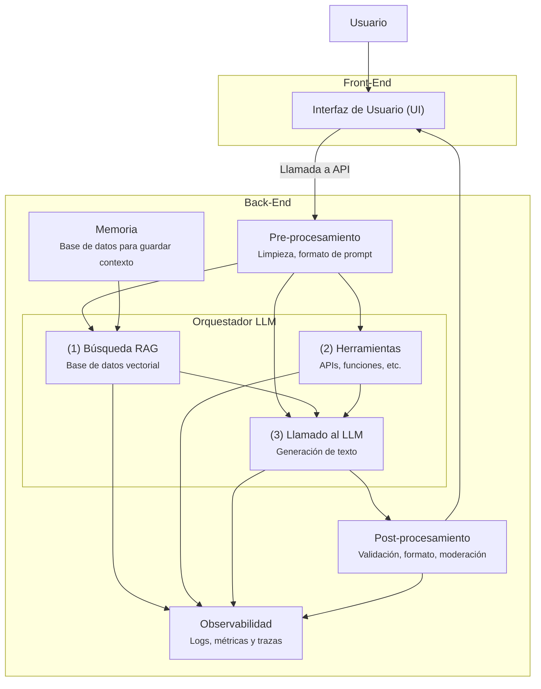
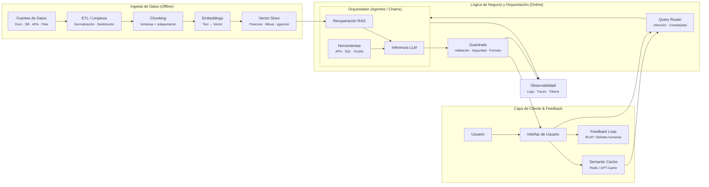

Large Language Model
# Semana 1
- [[Índice casos de uso, costos y arquitectura]]
-  [[LangChain]]
- [[LangChain vs LangGraph]]
## Arquitectura de aplicaciones basadas en LLMs
Antes teníamos un front que se conectaba al back mediante una API, ahora con los LLM es más complejo el tema.
Ahora hay un preprocesamiento que llama al orquestador LLM:
- ¿se debe buscar en otro lado? (bases de k)
- herramientas externas
- solo LLM
ahora hay dos componentes nuevos:
- Memoria: guarda la info para mantener contexto, personalizar respuestas
- Observabilidad: costos y latencia de los modelos
La latencia y escalabilidad se pueden ver más afectadas a raíz de los LLMs

Seguridad y privacidad:
- normativas específicas, manejo seguro de la memoria
- Gestión de errores y moderación
	- pos-procesamiento

El sistema se organiza en **capas bien delimitadas**, separando procesos **offline** (preparación del conocimiento) de procesos **online** (inferencia en tiempo real), lo que permite escalar, controlar costos y garantizar seguridad.

1. **Pipeline de ingesta (Offline)**  [[RAG - Ingesta de Datos]]
    Gestiona el ciclo de vida del dato antes de la inferencia. Incluye procesos de extracción, limpieza, normalización y chunking, seguidos por la vectorización mediante modelos de embeddings [[RAG - Embeddings y Vector DB]]. El resultado se persiste en un **Vector Store**, que se convierte en la fuente de contexto para RAG.  
    Esta fase es crítica para la calidad del sistema: errores aquí se propagan a todo el pipeline.
    
2. **Capa de cliente y feedback**  
    La interfaz no solo captura la consulta del usuario, sino que optimiza la experiencia y los costos mediante:
    
    - **Semantic Cache**, que reutiliza respuestas para consultas semánticamente equivalentes.
        
    - **Feedback Loop**, que recolecta señales humanas para refinamiento continuo (RLHF o ajustes posteriores).
        
3. **Lógica de negocio y orquestación (Online)**  
    El núcleo del sistema es el **Orquestador**, que funciona como una máquina de estados o motor de razonamiento:
    
    - Clasifica la intención y complejidad mediante un **Query Router**.
        
    - Decide cuándo aplicar **RAG** para inyectar contexto confiable.
        
    - Ejecuta **herramientas externas** (APIs, SQL, scripts) para capacidades agénticas.
        
    - Coordina la llamada al LLM adecuado según el caso de uso.
        
4. **Validación y seguridad (Guardrails)**  
    En el post-procesamiento, los guardrails validan que la salida del LLM:
    
    - Sea fiel al contexto (no alucinaciones).
        
    - Cumpla formatos estructurados esperados.
        
    - Respete políticas de seguridad, ética y cumplimiento normativo.  
        Desde ingeniería, un guardrail es un **middleware de validación semántica**, no un simple filtro.
        
1. **Observabilidad**  [[RAG - Observabilidad y Costos]]
    El sistema registra trazas, métricas de latencia y consumo de tokens en tiempo real, habilitando prácticas de **MLOps y FinOps**. Sin observabilidad, un sistema LLM es operativamente ciego.

> [!Ideas claves]
> - **RAG** resuelve el problema del **conocimiento estático y las alucinaciones** de los LLMs al inyectar información externa, confiable y actualizada como contexto antes de generar una respuesta.
>     
> - **Frameworks de orquestación** (LangChain, LlamaIndex) **abstraen la complejidad** de implementar patrones como RAG, chains y agentes, acelerando el desarrollo con componentes modulares listos para producción.
>     
> - En **FinOps para LLMs**, una decisión clave es **elegir el modelo adecuado según la complejidad de la tarea**, ya que los modelos más potentes son significativamente más costosos.
>     
> - **Construir una aplicación propia** con LLMs otorga **control sobre la lógica de negocio, el flujo y la experiencia de usuario**, mientras que usar un chatbot genérico es simplemente consumir un servicio cerrado.

## Introducción a LangChain: Framework para aplicaciones con LLMs

## Clase
- integraciones con otros productos, la IA ahora hace parte de nuestro pan de cada día
- n8n automatización de flujos
- integrar dentro de la estructura de nuestras soluciones y desarrollo
- reducir las alusinaciones
	- fuentes de info verificables
- NotebookLM:
	- puedo subir un doc, lo alimento y puedo hacerle preguntas
	- utiliza el k que tengo dentro de mis fuentes de info
- Entregas:
	- 4 y 8
- Google AI Studio
	- desarrolladores