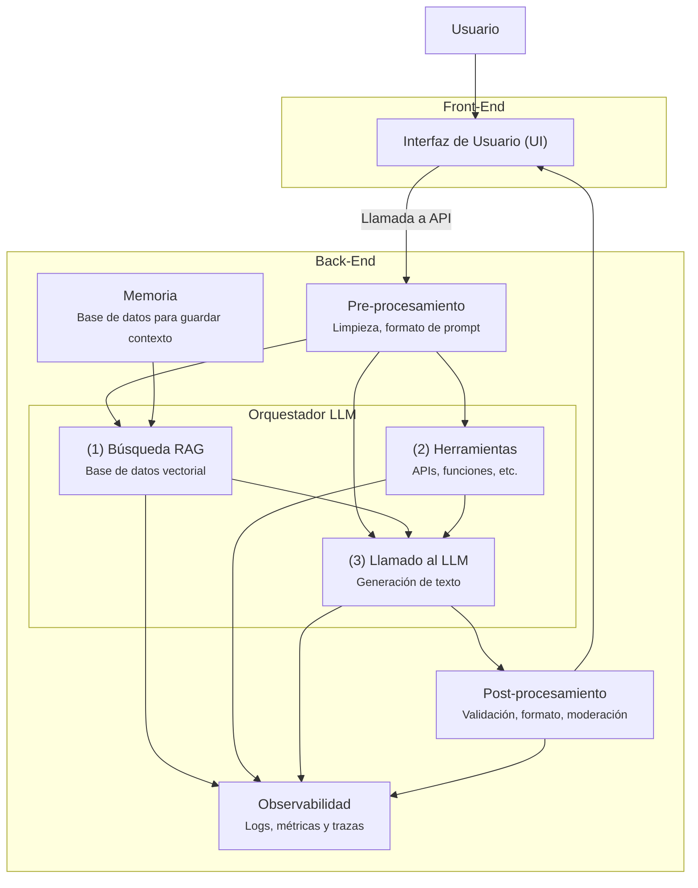

Large Language Model
# Semana 1
- [[Índice casos de uso, costos y arquitectura]]
## Arquitectura de aplicaciones basadas en LLMs
Antes teníamos un front que se conectaba al back mediante una API, ahora con los LLM es más complejo el tema.
Ahora hay un preprocesamiento que llama al orquestador LLM:
- ¿se debe buscar en otro lado? (bases de k)
- herramientas externas
- solo LLM
ahora hay dos componentes nuevos:
- Memoria: guarda la info para mantener contexto, personalizar respuestas
- Observabilidad: costos y latencia de los modelos
La latencia y escalabilidad se pueden ver más afectadas a raíz de los LLMs

Seguridad y privacidad:
- normativas específicas, manejo seguro de la memoria
- Gestión de errores y moderación
	- pos-procesamiento
