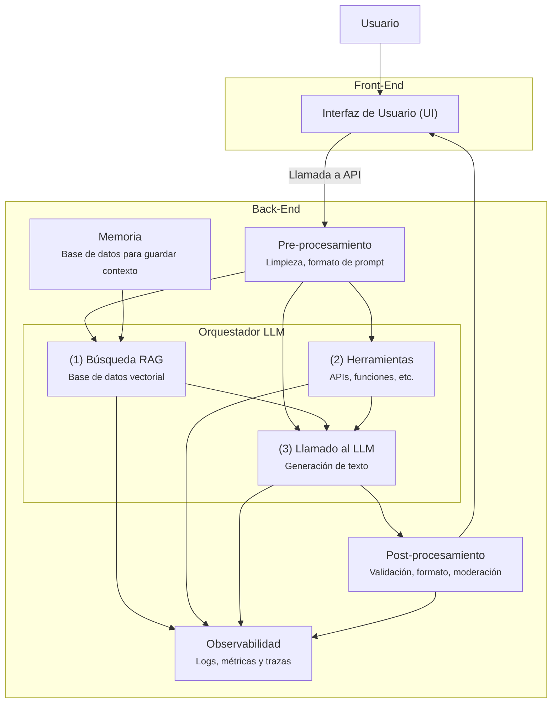
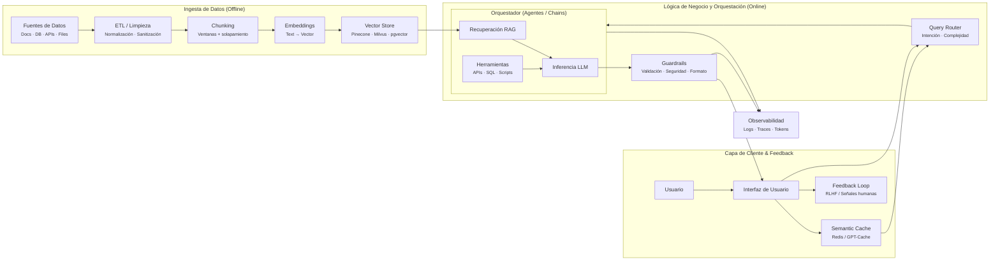

Large Language Model
# Semana 1
- [[Índice casos de uso, costos y arquitectura]]
-  [[LangChain]]
- [[LangChain vs LangGraph]]
## Arquitectura de aplicaciones basadas en LLMs
Antes teníamos un front que se conectaba al back mediante una API, ahora con los LLM es más complejo el tema.
Ahora hay un preprocesamiento que llama al orquestador LLM:
- ¿se debe buscar en otro lado? (bases de k)
- herramientas externas
- solo LLM
ahora hay dos componentes nuevos:
- Memoria: guarda la info para mantener contexto, personalizar respuestas
- Observabilidad: costos y latencia de los modelos
La latencia y escalabilidad se pueden ver más afectadas a raíz de los LLMs

Seguridad y privacidad:
- normativas específicas, manejo seguro de la memoria
- Gestión de errores y moderación
	- pos-procesamiento

```mermaid
flowchart TD
    %% =========================
    %% USUARIO
    %% =========================
    U[Usuario]

    %% =========================
    %% FRONT-END
    %% =========================
    subgraph FE["Front-End"]
        UI["Interfaz de Usuario (UI)"]
    end

    U --> UI

    %% =========================
    %% BACK-END
    %% =========================
    subgraph BE["Back-End"]
        PRE["Pre-procesamiento<br/><small>Limpieza, formato de prompt</small>"]

        POST["Post-procesamiento<br/><small>Validación, formato, moderación</small>"]

        OBS["Observabilidad<br/><small>Logs, métricas y trazas</small>"]

        MEM["Memoria<br/><small>Base de datos para guardar contexto</small>"]

        %% =========================
        %% ORQUESTADOR LLM
        %% =========================
        subgraph ORQ["Orquestador LLM"]
            RAG["(1) Búsqueda RAG<br/><small>Base de datos vectorial</small>"]
            TOOLS["(2) Herramientas<br/><small>APIs, funciones, etc.</small>"]
            LLM["(3) Llamado al LLM<br/><small>Generación de texto</small>"]
        end
    end

    %% =========================
    %% FLUJO PRINCIPAL
    %% =========================
    UI -->|Llamada a API| PRE

    PRE --> RAG
    PRE --> TOOLS
    PRE --> LLM

    MEM --> RAG

    RAG --> LLM
    TOOLS --> LLM

    LLM --> POST
    POST --> UI

    %% =========================
    %% OBSERVABILIDAD
    %% =========================
    RAG --> OBS
    TOOLS --> OBS
    LLM --> OBS
    POST --> OBS

```


El sistema se organiza en **capas bien delimitadas**, separando procesos **offline** (preparación del conocimiento) de procesos **online** (inferencia en tiempo real), lo que permite escalar, controlar costos y garantizar seguridad.

1. **Pipeline de ingesta (Offline)**  [[RAG - Ingesta de Datos]]
    Gestiona el ciclo de vida del dato antes de la inferencia. Incluye procesos de extracción, limpieza, normalización y chunking, seguidos por la vectorización mediante modelos de embeddings [[RAG - Embeddings y Vector DB]]. El resultado se persiste en un **Vector Store**, que se convierte en la fuente de contexto para RAG.  
    Esta fase es crítica para la calidad del sistema: errores aquí se propagan a todo el pipeline.
    
2. **Capa de cliente y feedback**  
    La interfaz no solo captura la consulta del usuario, sino que optimiza la experiencia y los costos mediante:
    
    - **Semantic Cache**, que reutiliza respuestas para consultas semánticamente equivalentes.
        
    - **Feedback Loop**, que recolecta señales humanas para refinamiento continuo (RLHF o ajustes posteriores).
        
3. **Lógica de negocio y orquestación (Online)**  
    El núcleo del sistema es el **Orquestador**, que funciona como una máquina de estados o motor de razonamiento:
    
    - Clasifica la intención y complejidad mediante un **Query Router**.
        
    - Decide cuándo aplicar **RAG** para inyectar contexto confiable.
        
    - Ejecuta **herramientas externas** (APIs, SQL, scripts) para capacidades agénticas.
        
    - Coordina la llamada al LLM adecuado según el caso de uso.
        
4. **Validación y seguridad (Guardrails)**  
    En el post-procesamiento, los guardrails validan que la salida del LLM:
    
    - Sea fiel al contexto (no alucinaciones).
        
    - Cumpla formatos estructurados esperados.
        
    - Respete políticas de seguridad, ética y cumplimiento normativo.  
        Desde ingeniería, un guardrail es un **middleware de validación semántica**, no un simple filtro.
        
1. **Observabilidad**  [[RAG - Observabilidad y Costos]]
    El sistema registra trazas, métricas de latencia y consumo de tokens en tiempo real, habilitando prácticas de **MLOps y FinOps**. Sin observabilidad, un sistema LLM es operativamente ciego.



```mermaid
flowchart LR
    %% =========================
    %% INGESTA OFFLINE
    %% =========================
    subgraph OFF["Ingesta de Datos (Offline)"]
        D1["Fuentes de Datos<br/><small>Docs · DB · APIs · Files</small>"]
        D2["ETL / Limpieza<br/><small>Normalización · Sanitización</small>"]
        D3["Chunking<br/><small>Ventanas + solapamiento</small>"]
        D4["Embeddings<br/><small>Text → Vector</small>"]
        D5["Vector Store<br/><small>Pinecone · Milvus · pgvector</small>"]

        D1 --> D2 --> D3 --> D4 --> D5
    end

    %% =========================
    %% CLIENTE
    %% =========================
    subgraph CLIENT["Capa de Cliente & Feedback"]
        U["Usuario"]
        UI["Interfaz de Usuario"]
        CACHE["Semantic Cache<br/><small>Redis / GPT-Cache</small>"]
        FB["Feedback Loop<br/><small>RLHF / Señales humanas</small>"]

        U --> UI
        UI --> CACHE
        UI --> FB
    end

    %% =========================
    %% ORQUESTACIÓN ONLINE
    %% =========================
    subgraph CORE["Lógica de Negocio y Orquestación (Online)"]
        ROUTER["Query Router<br/><small>Intención · Complejidad</small>"]

        subgraph ORQ["Orquestador (Agentes / Chains)"]
            RAG["Recuperación RAG"]
            TOOLS["Herramientas<br/><small>APIs · SQL · Scripts</small>"]
            LLM["Inferencia LLM"]
        end

        GUARD["Guardrails<br/><small>Validación · Seguridad · Formato</small>"]
    end

    %% =========================
    %% OBSERVABILIDAD
    %% =========================
    OBS["Observabilidad<br/><small>Logs · Traces · Tokens</small>"]

    %% =========================
    %% FLUJO
    %% =========================
    CACHE --> ROUTER
    UI --> ROUTER

    ROUTER --> ORQ
    D5 --> RAG

    RAG --> LLM
    TOOLS --> LLM

    LLM --> GUARD
    GUARD --> UI

    ORQ --> OBS
    GUARD --> OBS

```


> [!Ideas claves]
> - **RAG** resuelve el problema del **conocimiento estático y las alucinaciones** de los LLMs al inyectar información externa, confiable y actualizada como contexto antes de generar una respuesta.
>     
> - **Frameworks de orquestación** (LangChain, LlamaIndex) **abstraen la complejidad** de implementar patrones como RAG, chains y agentes, acelerando el desarrollo con componentes modulares listos para producción.
>     
> - En **FinOps para LLMs**, una decisión clave es **elegir el modelo adecuado según la complejidad de la tarea**, ya que los modelos más potentes son significativamente más costosos.
>     
> - **Construir una aplicación propia** con LLMs otorga **control sobre la lógica de negocio, el flujo y la experiencia de usuario**, mientras que usar un chatbot genérico es simplemente consumir un servicio cerrado.


## Introducción a LangChain: Framework para aplicaciones con LLMs

## Clase
- integraciones con otros productos, la IA ahora hace parte de nuestro pan de cada día
- n8n automatización de flujos
- integrar dentro de la estructura de nuestras soluciones y desarrollo
- reducir las alusinaciones
	- fuentes de info verificables
- NotebookLM:
	- puedo subir un doc, lo alimento y puedo hacerle preguntas
	- utiliza el k que tengo dentro de mis fuentes de info
- Entregas:
	- 4 y 8
- Google AI Studio
	- desarrolladores

# Semana 2
## 🧠 Ingeniería de Prompts y Cadena de Pensamiento

### 🔹 ¿Qué es un Prompt?

- Un **prompt** es una cadena de texto que el usuario entrega a un modelo de lenguaje para guiar la generación de una respuesta.
    
- Funciona como el **motor de contexto** que orienta al modelo hacia un objetivo específico.
    
- La calidad del resultado depende en gran medida de cómo esté formulado el prompt.
    

### 🔹 Ingeniería de Prompts

- Es el proceso de **diseñar prompts efectivos** para distintas tareas.
    
- Busca maximizar la utilidad, precisión y coherencia de las respuestas del modelo.
    
- Un prompt bien diseñado puede producir resultados que parecen “mágicos”, aunque todo ocurre por instrucciones claras detrás de escena.
    

### 🔹 Buenas prácticas al construir Prompts

- Usar **instrucciones claras y precisas**.
    
- Emplear **delimitadores** (```, [], tags HTML) para separar partes del texto.
    
- Diseñar **plantillas parametrizables** para reutilizar el prompt en distintos contextos.
    
- Para tareas complejas, **dividir el problema en pasos ordenados**.
    

### 🔹 Prompts estructurados

- Permiten solicitar múltiples acciones en una sola instrucción (ej. resumir, traducir, listar entidades y generar JSON).
    
- Ayudan al modelo a seguir un flujo lógico y producir resultados más confiables.
    

---

### 🔗 Chain of Thought (Cadena de Pensamiento)

#### 🔹 ¿Qué es?

- Técnica que mejora el rendimiento del modelo en tareas de **razonamiento complejo**.
    
- Se basa en incentivar al modelo a **pensar paso a paso**, imitando el razonamiento humano.
    

#### 🔹 Standard Prompting vs Chain of Thought

- **Standard Prompting**: se solicita directamente la respuesta → mayor probabilidad de error.
    
- **Chain of Thought**: se guía al modelo por pasos intermedios → mayor precisión y transparencia.
    

#### 🔹 Ejemplo

- Al descomponer problemas matemáticos en pasos claros (sumas intermedias), el modelo llega a respuestas correctas con mayor consistencia.
    

---

### ⚡ Zero-Shot Chain of Thought

#### 🔹 ¿En qué consiste?

- No requiere ejemplos previos.
    
- Basta con incluir una instrucción como: **“Let’s think step by step”**.
    
- El modelo razona correctamente sin demostraciones adicionales.
    

#### 🔹 Resultados clave (Kojima, 2022)

- Sin razonamiento guiado:
    
    - MultiArith: 17.7%
        
    - GSM8K: 10.4%
        
- Con _“Let’s think step by step”_:
    
    - MultiArith: 78.7%
        
    - GSM8K: 40.7%
        
- Combinando Zero-Shot + ejemplos (Few-Shot):
    
    - Hasta **93%** de precisión en MultiArith.
        

#### 🔹 Conclusión clave

- **Pequeños cambios en el prompt generan grandes diferencias en el rendimiento**.
    
- Frases claras y orientadas al razonamiento superan ampliamente instrucciones ambiguas.
    

---

### 🔍 Generación Aumentada por Recuperación (RAG / RAC)

#### 🔹 ¿Qué es RAC?

- **RAC (Retrieval-Augmented Generation)** es una técnica para mejorar la **precisión y confiabilidad** de los modelos de lenguaje usando **fuentes externas**.
    
- Fue propuesta por **Lewis et al. (2020)**.
    
- Combina **recuperación de información** con **generación de texto**.
    
- Reduce ambigüedad y disminuye las **alucinaciones** del modelo.
    

#### 🔹 ¿Para qué sirve?

- Aporta **contexto factual y actualizado**.
    
- Evita que el modelo asuma información incorrecta.
    
- Es especialmente útil en dominios **técnicos o especializados**.
    

---

### ⚙️ Funcionamiento de RAC

#### 1️⃣ Ingesta de documentos

- Fuentes externas: textos, PDFs, páginas web.
    
- Se convierten a texto plano.
    
- Se fragmentan en partes pequeñas llamadas **chunks**.
    

#### 2️⃣ Embeddings

- Cada chunk se transforma en un **embedding** (vector).
    
- Se usan **codificadores bidireccionales** como BERT.
    
- Los embeddings representan el significado semántico del texto.
    

#### 3️⃣ Base de datos vectorial

- Los embeddings se almacenan en una **base de datos vectorial**.
    
- Permite búsquedas eficientes usando **similitud coseno**.
    

---

### 🔎 Proceso de consulta

#### 4️⃣ Query del usuario

- La pregunta del usuario se convierte en un embedding usando el mismo modelo.
    
- Se compara contra la base de datos vectorial.
    

#### 5️⃣ Recuperación

- Se seleccionan los **K embeddings más similares**.
    
- Se recupera el texto original asociado a esos embeddings.
    

#### 6️⃣ Generación

- El texto recuperado se usa como **contexto enriquecido**.
    
- Este contexto se integra en el **prompt final**.
    
- El modelo genera una respuesta más precisa y fundamentada.
    

---

### 🧠 Conclusiones clave

- El uso de **Chain of Thought (CoT)** y frases como _“Let’s think step by step”_ mejora notablemente el razonamiento.
    
- **Zero-Shot CoT** permite razonamiento complejo **sin ejemplos**, optimizando tiempo y recursos.
    
- **Pequeños cambios en el prompt** pueden generar grandes diferencias en el rendimiento.
    
- **RAC/RAG** mejora la calidad de las respuestas al:
    
    - Integrar información externa.
        
    - Reducir alucinaciones.
        
    - Aportar contexto relevante y verificable.
## 🧠 Ventana de contexto vs RAG

### 🔹 ¿Qué es la ventana de contexto?

- Es la **cantidad máxima de texto (tokens)** que un LLM puede procesar y “recordar” en una sola inferencia.
    
- Incluye:
    
    - Prompt del usuario
        
    - Instrucciones del sistema
        
    - Historial de conversación
        
    - Datos recuperados externamente
        
    - Espacio reservado para la respuesta
        
- Entrada + salida **no pueden exceder** el límite total de la ventana.
    

👉 Ejemplo:

- Ventana de 128k tokens
    
- 127k tokens de entrada → solo 1k tokens disponibles para la salida.
    

### 🔹 Importancia de la ventana de contexto

- No es solo un parámetro técnico, es una **restricción fundamental de diseño**.
    
- Determina:
    
    - Capacidades del modelo
        
    - Eficiencia
        
    - Fiabilidad de la aplicación
        

### 🔹 Ventana de contexto como “memoria a corto plazo”

- Funciona como la **memoria de trabajo** del modelo.
    
- Está ligada al mecanismo de **self-attention** de los transformers.
    
- Cada token atiende a los demás tokens dentro de la ventana.
    
- La información fuera de la ventana es **invisible** para el modelo.
    

📌 Analogía:

- Igual que una persona no puede mantener toda la información en su mente al mismo tiempo, un LLM solo razona con lo que cabe en su ventana de contexto.
    

### 🔹 Qué ocurre cuando se supera la ventana

- El modelo empieza a **olvidar partes antiguas** de la conversación.
    
- Se pierde coherencia.
    
- En documentos largos, solo “ve” fragmentos y no conecta ideas distantes.
    

---

### 🎯 Implicaciones estratégicas de la ventana de contexto

- **Calidad y coherencia**  
    Ventanas más grandes permiten diálogos más largos y análisis más profundos.
    
- **Prompt engineering**  
    Diseñar prompts es gestionar un recurso limitado.  
    La información clave debe ubicarse al inicio o al final del contexto.
    
- **Capacidades de la aplicación**  
    Ventanas pequeñas → chatbots simples.  
    Ventanas grandes → análisis legal, código extenso, informes complejos.
    

---

### ⚠️ Limitaciones de la ventana de contexto

#### 🔸 Lost in the middle

- El modelo **no usa toda la información por igual**.
    
- Tiene sesgo de posición:
    
    - Mejor rendimiento al inicio y al final.
        
    - Peor rendimiento en el centro del contexto.
        
- Problema crítico para textos largos (“aguja en un pajar”).
    

📌 Ejemplo:

- Contrato legal de 150k tokens.
    
- Cláusula clave en la mitad → alta probabilidad de que el modelo la ignore.
    

---

#### 🔸 Costo de la atención

- La autoatención tiene **complejidad cuadrática (O(n²))**.
    
- Impactos directos:
    
    - **Costo económico**: más tokens → más caro (API o infraestructura).
        
    - **Latencia**: respuestas más lentas.
        
    - **Escalabilidad limitada**.
        

---

#### 🔸 Corte de entrenamiento (Knowledge Cutoff)

- Los LLMs tienen una **fecha de corte de conocimiento**.
    
- No conocen hechos posteriores a su entrenamiento.
    
- La ventana de contexto **no soluciona** este problema:
    
    - No hay conocimiento persistente ni actualizado.
        

---

#### 🔸 Riesgo de alucinación

- Más contexto ≠ más precisión.
    
- Puede aumentar las alucinaciones por:
    
    - **Dilución de la atención** (ruido > señal).
        
    - **Información conflictiva** dentro del contexto.
        
- El modelo tiende a “inventar” respuestas plausibles.
    

📌 Estos problemas están interrelacionados y no se resuelven solo aumentando la ventana.

---

### 🚀 RAG como solución

#### 🔹 ¿Qué es RAG?

- **Retrieval-Augmented Generation** combina:
    
    - LLM
        
    - Sistema externo de recuperación de información
        
- El modelo razona sobre **información factual y actualizada** recuperada en tiempo real.
    

#### 🔹 Rol del LLM en RAG

- Pasa de ser un “almacén de conocimiento” a un:
    
    - **Motor de razonamiento bajo demanda**
        
- El conocimiento y el razonamiento quedan **desacoplados**.
    

---

### ⚙️ Funcionamiento de RAG

#### 1️⃣ Fase offline – Indexación

- Preparación del conocimiento.
    
- Incluye:
    
    - Chunking de documentos
        
    - Generación de embeddings
        
    - Construcción de índices vectoriales
        
- Se ejecuta una vez o periódicamente.
    

#### 2️⃣ Fase online – Recuperación y generación

- Consulta del usuario → embedding.
    
- Recuperación de fragmentos más relevantes.
    
- Estos fragmentos se insertan en el contexto.
    
- El LLM genera una respuesta **fundamentada y precisa**.
    

---

### ✅ Conclusión

- La ventana de contexto es un recurso limitado que debe **gestionarse**, no maximizarse.
    
- RAG:
    
    - Reduce alucinaciones
        
    - Aporta conocimiento actualizado
        
    - Mejora precisión y auditabilidad
        
- Es un **patrón arquitectónico clave** para aplicaciones empresariales donde la exactitud, la trazabilidad y la escalabilidad son críticas.
## Tokens y Vectores en LLMs

### Token
- Unidad mínima de texto que procesa un LLM.
- No equivale siempre a una palabra.
- Puede ser parte de una palabra, un símbolo o un número.
- La ventana de contexto se mide en tokens.
- Prompt + historial + contexto + respuesta consumen tokens.

### Vector
- Representación numérica del significado de un texto.
- Es un arreglo de números (embeddings).
- Permite medir similitud semántica.
- Se usa para búsqueda y recuperación de información.

### Relación
- Texto → tokens → vector.
- Tokens sirven para razonar.
- Vectores sirven para buscar.

### En RAG
- Vectores: recuperación eficiente de información.
- Tokens: generación de la respuesta.


## 🧩 Tokens, Tokenización y Embeddings

En este recurso abordamos **tres conceptos fundamentales** para entender cómo funcionan los modelos de lenguaje modernos: **tokens**, **tokenización** y **embeddings**. Estos elementos son la base sobre la cual los modelos pueden procesar texto, comparar significados y razonar sobre la información.

---

### 🔹 Tokens

Un **token** es la **unidad mínima de texto** que un modelo de lenguaje puede procesar.  
Un token **no siempre equivale a una palabra completa**. Puede ser:

- Una palabra
    
- Parte de una palabra
    
- Un signo de puntuación
    
- Un número
    
- Un emoji
    

El modelo no trabaja directamente con palabras humanas, sino con estas unidades básicas.

---

### 🔹 Tokenización

La **tokenización** es el proceso automático que toma una frase y la divide en una **secuencia de tokens** que el modelo sí puede manejar.  
Este proceso lo realiza una herramienta llamada **Tokenizer**, cuyo comportamiento depende del modelo utilizado.

📌 Ejemplo:

Frase original:

> _Los ecosistemas submarinos son increíblemente complejos._

Según el tokenizer:

- Puede convertirse en un token por palabra.
    
- O dividir palabras en **subpalabras**, como `eco + sistemas` o `sub + marinos`.
    
- Los signos de puntuación y emojis también cuentan como tokens adicionales.
    

Cuando una palabra no existe en el vocabulario del modelo, el tokenizer la divide en subpalabras conocidas.

---

### 🔹 ¿Por qué importan los tokens?

- Cada token **consume espacio** en la ventana de contexto.
    
- Más tokens implican:
    
    - Mayor costo de inferencia.
        
    - Menos espacio disponible para la conversación o la respuesta.
        
- Por eso es importante escribir textos **claros y concisos**, reduciendo tokens sin perder significado.
    

---

### 🔹 Vocabulario y mapeo numérico

El **vocabulario** es un diccionario que asigna a cada token un **identificador entero fijo**.

Ejemplo (simplificado):

- `los` → 84
    
- `increíblemente` → 73
    
- `complejos` → 98
    

Este mapeo es:

- Determinístico
    
- Específico de cada tokenizer
    
- Necesario para que el modelo procese el texto de forma eficiente
    

Estos identificadores numéricos son la entrada para la siguiente etapa: los embeddings.

---

### 🔹 Embeddings

Un **embedding** es un **vector numérico de dimensión fija** que representa el **significado** de un texto.

- Se obtiene al pasar los tokens por una red neuronal entrenada.
    
- Cada token se convierte en un vector.
    
- Luego, estos vectores se combinan para formar el embedding del texto completo.
    

Durante el entrenamiento:

- Textos con significado similar quedan **cerca** en el espacio vectorial.
    
- Textos con significado distinto quedan **lejos**.
    

📌 Principio clave:

> **Cuanto más cerca están dos vectores, más similar es su significado.**

---

### 🔹 Búsqueda semántica

La **búsqueda semántica** recupera información por **significado**, no por coincidencia literal de palabras.

Proceso:

1. La consulta se convierte en un embedding.
    
2. Los documentos también están representados como embeddings.
    
3. Se calcula la cercanía entre vectores.
    

Métricas comunes:

- Similitud coseno
    
- Producto punto
    
- Distancia euclidiana
    

📌 Ejemplo:

Consulta:

> _vida en arrecifes_

Resultados más cercanos:

- arrecife de coral
    
- peces tropicales
    
- submarino
    

Resultados lejanos:

- café
    
- cafetera
    

La aplicación devolvería un **top-K** de resultados más similares.

---

### 🔹 Síntesis

- Un **token** es la unidad mínima que procesa el modelo.
    
- La **tokenización** transforma texto en tokens.
    
- Los **embeddings** representan el significado en forma numérica.
    
- Gracias a los embeddings, los modelos pueden:
    
    - Buscar por significado
        
    - Comparar textos
        
    - Conectar ideas relacionadas
        

Estos conceptos son la base de técnicas como **RAG** y la **búsqueda semántica**.  
En las actividades propuestas encontrarás **laboratorios prácticos** para aplicar lo aprendido.

## 🗂️ Bases de datos vectoriales

Las bases de datos tradicionales buscan **coincidencias exactas de palabras**, por lo que muchas veces no entienden el significado real de una consulta. Las **bases de datos vectoriales** resuelven este problema al representar texto, imágenes o audio como **vectores numéricos** que capturan su significado.

Cada vector actúa como una **dirección en un espacio semántico**, permitiendo encontrar información similar aunque no use las mismas palabras. Esto habilita la **búsqueda semántica**, es decir, la búsqueda por significado y no por texto literal.

En aplicaciones con **modelos de lenguaje**, las bases de datos vectoriales funcionan como la **memoria de largo plazo** y la **fuente de conocimiento externa**. Al integrarlas mediante **RAG (Retrieval-Augmented Generation)**, el modelo primero recupera información relevante y luego genera respuestas basadas en datos reales y actualizados, reduciendo alucinaciones.

En síntesis, las bases de datos vectoriales permiten construir aplicaciones con conocimiento propio, actualizable y semánticamente inteligente.

## Chunking
### ¿Qué es la fragmentación (chunking)?

- Proceso de dividir documentos largos en segmentos pequeños y coherentes.
    
- Cada _chunk_ se convierte en la **unidad atómica de conocimiento**.
    
- Es el insumo directo para:
    
    - Generación de _embeddings_.
        
    - Indexación en bases de datos vectoriales.
        
    - Recuperación semántica para el LLM.
        

---

### Importancia del chunking en RAG

- Impacta directamente la **precisión de la recuperación**.
    
- Determina la **calidad del contexto** entregado al LLM.
    
- Una mala fragmentación produce:
    
    - Información irrelevante.
        
    - Contexto incompleto o fragmentado.
        
    - Respuestas imprecisas o inconsistentes.
        

---

### Calidad del documento como prerrequisito

- El formato del documento afecta la segmentación semántica.
    
- Problemas comunes:
    
    - Jerarquías ambiguas.
        
    - Artefactos de OCR.
        
    - Encabezados no estructurados.
        
- Consecuencias:
    
    - Pérdida de relaciones entre secciones.
        
    - Degradación severa de la precisión.
        
- Técnicas de mitigación:
    
    - Normalización y limpieza con expresiones regulares.
        
    - Parsers estructurales.
        
    - Segmentación guiada por reglas.
        
    - Revisión manual cuando es necesario.
        

---

### ¿Por qué es necesario fragmentar?

- **Ventana de contexto finita** de LLMs y modelos de _embeddings_.
    
- Permite procesar documentos de cualquier longitud sin truncar información.
    
- Mejora la calidad de los _embeddings_ al:
    
    - Enfocar cada vector en una idea específica.
        
- Incrementa la relevancia de los resultados recuperados frente a una consulta.
    

---

### Parámetros clave del chunking

- **Tamaño del chunk**
    
    - Medido en tokens, palabras o caracteres.
        
    - No existe un valor universal óptimo.
        
    - Compromiso entre:
        
        - Preservar contexto.
            
        - Precisión en la recuperación.
            
- **Solapamiento (overlap)**
    
    - Repetición parcial entre chunks consecutivos.
        
    - Evita cortes abruptos de ideas.
        
    - Valor típico: **10% – 20%** del tamaño del chunk.
        

---

### Estrategias de fragmentación

#### Basadas en reglas

- **Tamaño fijo**
    
    - Simple y eficiente.
        
    - Ignora la estructura semántica.
        
- **Unidades lingüísticas**
    
    - Divide por oraciones o párrafos.
        
    - Mantiene coherencia, pero genera tamaños variables.
        
- **Fragmentación recursiva por caracteres**
    
    - Usa separadores jerárquicos.
        
    - Balancea estructura y límite de tamaño.
        

#### Conscientes del contenido

- **Fragmentación semántica**
    
    - Agrupa texto según similitud semántica.
        
    - Detecta cambios de tema.
        
    - Alto costo computacional.
        
- **Basada en estructura del documento**
    
    - Usa encabezados, secciones o funciones.
        
    - Depende de formatos bien estructurados.
        
- **Agentic Chunking**
    
    - Utiliza un LLM para decidir los cortes.
        
    - Muy costosa, pero altamente contextual.
        

---

### Impacto en rendimiento y costos

- **Chunks grandes**
    
    - Menos _embeddings_.
        
    - Más contexto por consulta.
        
    - Mayor costo y latencia en inferencia.
        
- **Chunks pequeños**
    
    - Más _embeddings_ y almacenamiento.
        
    - Recuperación más fina.
        
    - Posible aumento de latencia en búsqueda.
        
- La fragmentación es una **decisión de diseño**, no solo técnica.
    
    - Consultas factuales → chunks pequeños.
        
    - Consultas analíticas → chunks más grandes.
        

---

### Conclusión

El _chunking_ es uno de los factores más determinantes en la eficacia de un sistema RAG. Define cómo se estructura el conocimiento, cómo se representa semánticamente y cómo será recuperado para generar respuestas. Elegir una estrategia de fragmentación adecuada implica equilibrar contexto, precisión, costos y perfil de uso, convirtiendo este proceso en una decisión arquitectónica central que condiciona el rendimiento global del sistema.

## LangChain: introducción al modelo, prompting y memoria

### ¿Por qué el diseño de prompts es clave?

- El prompt define **cómo el modelo interpreta la tarea**.
    
- Un prompt bien estructurado:
    
    - Mejora la precisión.
        
    - Reduce ambigüedad.
        
    - Aumenta la utilidad de la respuesta.
        
- Para ingeniería de software, el prompting es una **habilidad de diseño**, no solo de escritura.
    

---

### ¿Por qué LangChain y no solo el SDK del proveedor?

- Permite desarrollar aplicaciones sin quedar atadas a un único proveedor.
    
- Ofrece **patrones listos para usar**, como:
    
    - _Chain of Thought_.
        
    - _Tool Calling_.
        
- Reduce el tiempo de desarrollo al evitar “reinventar la rueda”.
    
- Facilita el mantenimiento y la evolución del sistema a largo plazo.
    

---

### Filosofía de bloques de construcción

- LangChain está diseñado como un sistema **modular e intercambiable**.
    
- Todos los componentes siguen interfaces comunes:
    
    - Modelos de chat.
        
    - Embeddings.
        
    - Parsers de salida.
        
    - Bases de datos vectoriales.
        
- Beneficio principal:
    
    - Cambiar de proveedor (OpenAI, Anthropic, Gemini, modelos open-source) **sin reescribir la aplicación**.
        

---

### Abstracción entre proveedores

- Diferentes proveedores usan formatos internos distintos.
    
- LangChain unifica esas diferencias:
    
    - Permite usar múltiples modelos en una misma aplicación.
        
    - Hace posible combinar proveedores sin fricción.
        
- La abstracción aplica a:
    
    - Modelos de chat.
        
    - Modelos de embeddings.
        
    - Almacenes vectoriales.
        

---

### Componentes clave en los ejemplos

- **Modelos de chat**: proveedor de generación de texto.
    
- **Embeddings**: representación vectorial del significado.
    
- **Vector stores**: almacenamiento y recuperación semántica.
    
- Todos estos componentes son **sustituibles** gracias a las interfaces de LangChain.
    

---

### Interfaces principales de LangChain

- **LLM interface**
    
    - Modelo clásico de completado de texto.
        
    - Entrada: texto → Salida: texto.
        
    - Cada vez menos recomendada.
        
- **Chat Model interface**
    
    - Basada en mensajes con roles.
        
    - Más adecuada para flujos complejos y agentes.
        
    - Es la interfaz recomendada actualmente.
        

---

### Ventajas del modelo de chat

- Uso de roles:
    
    - _System_ (comportamiento del asistente).
        
    - _Human_ (entrada del usuario).
        
    - _Tool_ (interacción con herramientas).
        
- Permite:
    
    - Controlar el estilo y comportamiento del modelo.
        
    - Crear conversaciones coherentes y predecibles.
        
    - Separar instrucciones, contexto y consultas.
        

---

### Prompts dinámicos con plantillas

- Un prompt no debe ser siempre texto estático.
    
- LangChain permite:
    
    - Definir plantillas reutilizables.
        
    - Inyectar datos dinámicos en tiempo de ejecución.
        
- Uso de placeholders:
    
    - Sintaxis tipo _f-string_ (`{variable}`).
        
- Beneficio:
    
    - Prompts más flexibles y mantenibles.
        

---

### PromptTemplate vs ChatPromptTemplate

- **PromptTemplate**
    
    - Genera un único texto plano.
        
    - Útil para modelos de completado.
        
- **ChatPromptTemplate**
    
    - Genera una lista ordenada de mensajes con roles.
        
    - Más natural para modelos conversacionales.
        
    - Permite estructurar:
        
        - Instrucciones del sistema.
            
        - Ejemplos.
            
        - Mensajes del usuario.
            
- Es la opción preferida para aplicaciones modernas basadas en chat.
    

---

### Relación con RAG y los siguientes pasos

- LangChain sirve como **habilitador** para sistemas RAG.
    
- Permite:
    
    - Orquestar recuperación de contexto.
        
    - Integrar embeddings y vector stores.
        
    - Construir agentes y pipelines complejos.
        
- Los laboratorios posteriores profundizan en:
    
    - Construcción de los primeros componentes RAG.
        
    - Uso práctico de estos bloques en aplicaciones reales.
        

---

### Conclusión

LangChain no es solo una capa de conveniencia sobre las APIs de los modelos de lenguaje; es un framework de orquestación que introduce buenas prácticas de diseño, modularidad y abstracción. Al estructurar prompts, modelos y flujos mediante interfaces comunes, permite construir aplicaciones con LLMs que son más mantenibles, escalables y preparadas para la rápida evolución del ecosistema de la IA generativa.