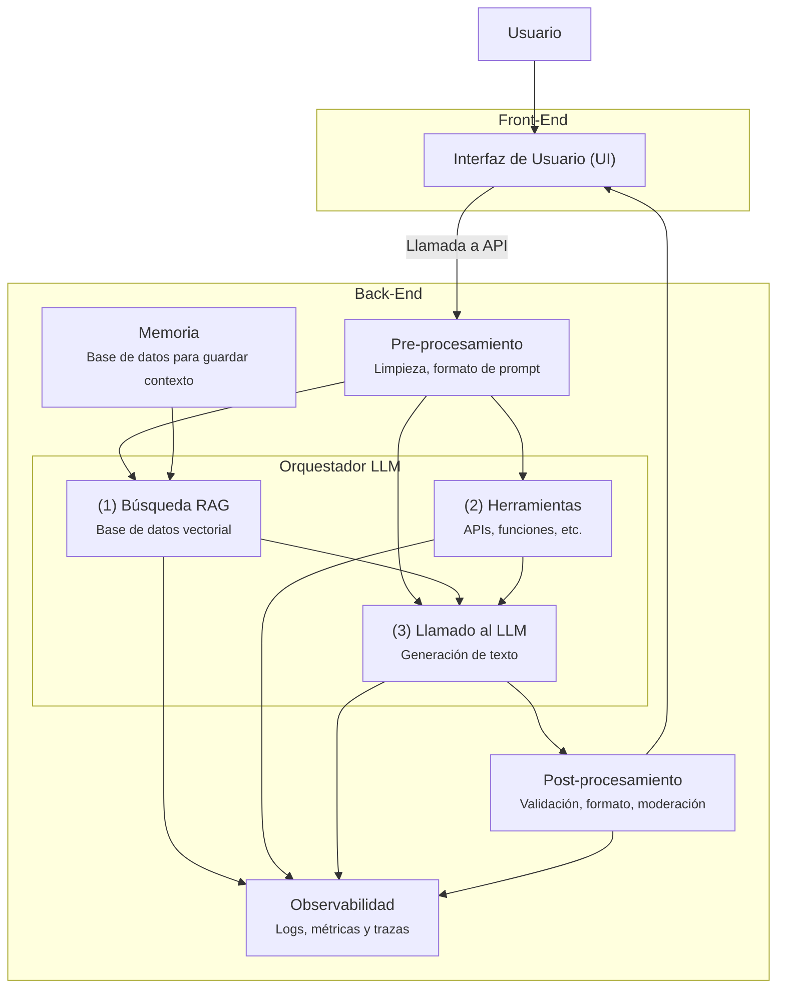
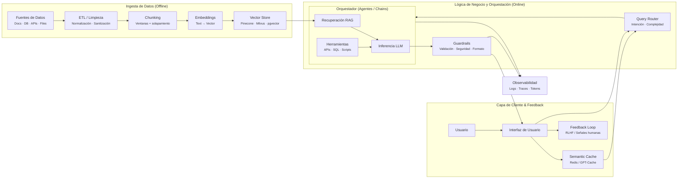

Large Language Model
# Semana 1
- [[Índice casos de uso, costos y arquitectura]]
-  [[LangChain]]
- [[LangChain vs LangGraph]]
## Arquitectura de aplicaciones basadas en LLMs
Antes teníamos un front que se conectaba al back mediante una API, ahora con los LLM es más complejo el tema.
Ahora hay un preprocesamiento que llama al orquestador LLM:
- ¿se debe buscar en otro lado? (bases de k)
- herramientas externas
- solo LLM
ahora hay dos componentes nuevos:
- Memoria: guarda la info para mantener contexto, personalizar respuestas
- Observabilidad: costos y latencia de los modelos
La latencia y escalabilidad se pueden ver más afectadas a raíz de los LLMs

Seguridad y privacidad:
- normativas específicas, manejo seguro de la memoria
- Gestión de errores y moderación
	- pos-procesamiento

```mermaid
flowchart TD
    %% =========================
    %% USUARIO
    %% =========================
    U[Usuario]

    %% =========================
    %% FRONT-END
    %% =========================
    subgraph FE["Front-End"]
        UI["Interfaz de Usuario (UI)"]
    end

    U --> UI

    %% =========================
    %% BACK-END
    %% =========================
    subgraph BE["Back-End"]
        PRE["Pre-procesamiento<br/><small>Limpieza, formato de prompt</small>"]

        POST["Post-procesamiento<br/><small>Validación, formato, moderación</small>"]

        OBS["Observabilidad<br/><small>Logs, métricas y trazas</small>"]

        MEM["Memoria<br/><small>Base de datos para guardar contexto</small>"]

        %% =========================
        %% ORQUESTADOR LLM
        %% =========================
        subgraph ORQ["Orquestador LLM"]
            RAG["(1) Búsqueda RAG<br/><small>Base de datos vectorial</small>"]
            TOOLS["(2) Herramientas<br/><small>APIs, funciones, etc.</small>"]
            LLM["(3) Llamado al LLM<br/><small>Generación de texto</small>"]
        end
    end

    %% =========================
    %% FLUJO PRINCIPAL
    %% =========================
    UI -->|Llamada a API| PRE

    PRE --> RAG
    PRE --> TOOLS
    PRE --> LLM

    MEM --> RAG

    RAG --> LLM
    TOOLS --> LLM

    LLM --> POST
    POST --> UI

    %% =========================
    %% OBSERVABILIDAD
    %% =========================
    RAG --> OBS
    TOOLS --> OBS
    LLM --> OBS
    POST --> OBS

```


El sistema se organiza en **capas bien delimitadas**, separando procesos **offline** (preparación del conocimiento) de procesos **online** (inferencia en tiempo real), lo que permite escalar, controlar costos y garantizar seguridad.

1. **Pipeline de ingesta (Offline)**  [[RAG - Ingesta de Datos]]
    Gestiona el ciclo de vida del dato antes de la inferencia. Incluye procesos de extracción, limpieza, normalización y chunking, seguidos por la vectorización mediante modelos de embeddings [[RAG - Embeddings y Vector DB]]. El resultado se persiste en un **Vector Store**, que se convierte en la fuente de contexto para RAG.  
    Esta fase es crítica para la calidad del sistema: errores aquí se propagan a todo el pipeline.
    
2. **Capa de cliente y feedback**  
    La interfaz no solo captura la consulta del usuario, sino que optimiza la experiencia y los costos mediante:
    
    - **Semantic Cache**, que reutiliza respuestas para consultas semánticamente equivalentes.
        
    - **Feedback Loop**, que recolecta señales humanas para refinamiento continuo (RLHF o ajustes posteriores).
        
3. **Lógica de negocio y orquestación (Online)**  
    El núcleo del sistema es el **Orquestador**, que funciona como una máquina de estados o motor de razonamiento:
    
    - Clasifica la intención y complejidad mediante un **Query Router**.
        
    - Decide cuándo aplicar **RAG** para inyectar contexto confiable.
        
    - Ejecuta **herramientas externas** (APIs, SQL, scripts) para capacidades agénticas.
        
    - Coordina la llamada al LLM adecuado según el caso de uso.
        
4. **Validación y seguridad (Guardrails)**  
    En el post-procesamiento, los guardrails validan que la salida del LLM:
    
    - Sea fiel al contexto (no alucinaciones).
        
    - Cumpla formatos estructurados esperados.
        
    - Respete políticas de seguridad, ética y cumplimiento normativo.  
        Desde ingeniería, un guardrail es un **middleware de validación semántica**, no un simple filtro.
        
1. **Observabilidad**  [[RAG - Observabilidad y Costos]]
    El sistema registra trazas, métricas de latencia y consumo de tokens en tiempo real, habilitando prácticas de **MLOps y FinOps**. Sin observabilidad, un sistema LLM es operativamente ciego.



```mermaid
flowchart LR
    %% =========================
    %% INGESTA OFFLINE
    %% =========================
    subgraph OFF["Ingesta de Datos (Offline)"]
        D1["Fuentes de Datos<br/><small>Docs · DB · APIs · Files</small>"]
        D2["ETL / Limpieza<br/><small>Normalización · Sanitización</small>"]
        D3["Chunking<br/><small>Ventanas + solapamiento</small>"]
        D4["Embeddings<br/><small>Text → Vector</small>"]
        D5["Vector Store<br/><small>Pinecone · Milvus · pgvector</small>"]

        D1 --> D2 --> D3 --> D4 --> D5
    end

    %% =========================
    %% CLIENTE
    %% =========================
    subgraph CLIENT["Capa de Cliente & Feedback"]
        U["Usuario"]
        UI["Interfaz de Usuario"]
        CACHE["Semantic Cache<br/><small>Redis / GPT-Cache</small>"]
        FB["Feedback Loop<br/><small>RLHF / Señales humanas</small>"]

        U --> UI
        UI --> CACHE
        UI --> FB
    end

    %% =========================
    %% ORQUESTACIÓN ONLINE
    %% =========================
    subgraph CORE["Lógica de Negocio y Orquestación (Online)"]
        ROUTER["Query Router<br/><small>Intención · Complejidad</small>"]

        subgraph ORQ["Orquestador (Agentes / Chains)"]
            RAG["Recuperación RAG"]
            TOOLS["Herramientas<br/><small>APIs · SQL · Scripts</small>"]
            LLM["Inferencia LLM"]
        end

        GUARD["Guardrails<br/><small>Validación · Seguridad · Formato</small>"]
    end

    %% =========================
    %% OBSERVABILIDAD
    %% =========================
    OBS["Observabilidad<br/><small>Logs · Traces · Tokens</small>"]

    %% =========================
    %% FLUJO
    %% =========================
    CACHE --> ROUTER
    UI --> ROUTER

    ROUTER --> ORQ
    D5 --> RAG

    RAG --> LLM
    TOOLS --> LLM

    LLM --> GUARD
    GUARD --> UI

    ORQ --> OBS
    GUARD --> OBS

```


> [!Ideas claves]
> - **RAG** resuelve el problema del **conocimiento estático y las alucinaciones** de los LLMs al inyectar información externa, confiable y actualizada como contexto antes de generar una respuesta.
>     
> - **Frameworks de orquestación** (LangChain, LlamaIndex) **abstraen la complejidad** de implementar patrones como RAG, chains y agentes, acelerando el desarrollo con componentes modulares listos para producción.
>     
> - En **FinOps para LLMs**, una decisión clave es **elegir el modelo adecuado según la complejidad de la tarea**, ya que los modelos más potentes son significativamente más costosos.
>     
> - **Construir una aplicación propia** con LLMs otorga **control sobre la lógica de negocio, el flujo y la experiencia de usuario**, mientras que usar un chatbot genérico es simplemente consumir un servicio cerrado.


## Introducción a LangChain: Framework para aplicaciones con LLMs

## Clase
- integraciones con otros productos, la IA ahora hace parte de nuestro pan de cada día
- n8n automatización de flujos
- integrar dentro de la estructura de nuestras soluciones y desarrollo
- reducir las alusinaciones
	- fuentes de info verificables
- NotebookLM:
	- puedo subir un doc, lo alimento y puedo hacerle preguntas
	- utiliza el k que tengo dentro de mis fuentes de info
- Entregas:
	- 4 y 8
- Google AI Studio
	- desarrolladores

# Semana 2
## 🧠 Ingeniería de Prompts y Cadena de Pensamiento

### 🔹 ¿Qué es un Prompt?

- Un **prompt** es una cadena de texto que el usuario entrega a un modelo de lenguaje para guiar la generación de una respuesta.
    
- Funciona como el **motor de contexto** que orienta al modelo hacia un objetivo específico.
    
- La calidad del resultado depende en gran medida de cómo esté formulado el prompt.
    

### 🔹 Ingeniería de Prompts

- Es el proceso de **diseñar prompts efectivos** para distintas tareas.
    
- Busca maximizar la utilidad, precisión y coherencia de las respuestas del modelo.
    
- Un prompt bien diseñado puede producir resultados que parecen “mágicos”, aunque todo ocurre por instrucciones claras detrás de escena.
    

### 🔹 Buenas prácticas al construir Prompts

- Usar **instrucciones claras y precisas**.
    
- Emplear **delimitadores** (```, [], tags HTML) para separar partes del texto.
    
- Diseñar **plantillas parametrizables** para reutilizar el prompt en distintos contextos.
    
- Para tareas complejas, **dividir el problema en pasos ordenados**.
    

### 🔹 Prompts estructurados

- Permiten solicitar múltiples acciones en una sola instrucción (ej. resumir, traducir, listar entidades y generar JSON).
    
- Ayudan al modelo a seguir un flujo lógico y producir resultados más confiables.
    

---

### 🔗 Chain of Thought (Cadena de Pensamiento)

#### 🔹 ¿Qué es?

- Técnica que mejora el rendimiento del modelo en tareas de **razonamiento complejo**.
    
- Se basa en incentivar al modelo a **pensar paso a paso**, imitando el razonamiento humano.
    

#### 🔹 Standard Prompting vs Chain of Thought

- **Standard Prompting**: se solicita directamente la respuesta → mayor probabilidad de error.
    
- **Chain of Thought**: se guía al modelo por pasos intermedios → mayor precisión y transparencia.
    

#### 🔹 Ejemplo

- Al descomponer problemas matemáticos en pasos claros (sumas intermedias), el modelo llega a respuestas correctas con mayor consistencia.
    

---

### ⚡ Zero-Shot Chain of Thought

#### 🔹 ¿En qué consiste?

- No requiere ejemplos previos.
    
- Basta con incluir una instrucción como: **“Let’s think step by step”**.
    
- El modelo razona correctamente sin demostraciones adicionales.
    

#### 🔹 Resultados clave (Kojima, 2022)

- Sin razonamiento guiado:
    
    - MultiArith: 17.7%
        
    - GSM8K: 10.4%
        
- Con _“Let’s think step by step”_:
    
    - MultiArith: 78.7%
        
    - GSM8K: 40.7%
        
- Combinando Zero-Shot + ejemplos (Few-Shot):
    
    - Hasta **93%** de precisión en MultiArith.
        

#### 🔹 Conclusión clave

- **Pequeños cambios en el prompt generan grandes diferencias en el rendimiento**.
    
- Frases claras y orientadas al razonamiento superan ampliamente instrucciones ambiguas.
    

---

### 🔍 Generación Aumentada por Recuperación (RAG / RAC)

#### 🔹 ¿Qué es RAC?

- **RAC (Retrieval-Augmented Generation)** es una técnica para mejorar la **precisión y confiabilidad** de los modelos de lenguaje usando **fuentes externas**.
    
- Fue propuesta por **Lewis et al. (2020)**.
    
- Combina **recuperación de información** con **generación de texto**.
    
- Reduce ambigüedad y disminuye las **alucinaciones** del modelo.
    

#### 🔹 ¿Para qué sirve?

- Aporta **contexto factual y actualizado**.
    
- Evita que el modelo asuma información incorrecta.
    
- Es especialmente útil en dominios **técnicos o especializados**.
    

---

### ⚙️ Funcionamiento de RAC

#### 1️⃣ Ingesta de documentos

- Fuentes externas: textos, PDFs, páginas web.
    
- Se convierten a texto plano.
    
- Se fragmentan en partes pequeñas llamadas **chunks**.
    

#### 2️⃣ Embeddings

- Cada chunk se transforma en un **embedding** (vector).
    
- Se usan **codificadores bidireccionales** como BERT.
    
- Los embeddings representan el significado semántico del texto.
    

#### 3️⃣ Base de datos vectorial

- Los embeddings se almacenan en una **base de datos vectorial**.
    
- Permite búsquedas eficientes usando **similitud coseno**.
    

---

### 🔎 Proceso de consulta

#### 4️⃣ Query del usuario

- La pregunta del usuario se convierte en un embedding usando el mismo modelo.
    
- Se compara contra la base de datos vectorial.
    

#### 5️⃣ Recuperación

- Se seleccionan los **K embeddings más similares**.
    
- Se recupera el texto original asociado a esos embeddings.
    

#### 6️⃣ Generación

- El texto recuperado se usa como **contexto enriquecido**.
    
- Este contexto se integra en el **prompt final**.
    
- El modelo genera una respuesta más precisa y fundamentada.
    

---

### 🧠 Conclusiones clave

- El uso de **Chain of Thought (CoT)** y frases como _“Let’s think step by step”_ mejora notablemente el razonamiento.
    
- **Zero-Shot CoT** permite razonamiento complejo **sin ejemplos**, optimizando tiempo y recursos.
    
- **Pequeños cambios en el prompt** pueden generar grandes diferencias en el rendimiento.
    
- **RAC/RAG** mejora la calidad de las respuestas al:
    
    - Integrar información externa.
        
    - Reducir alucinaciones.
        
    - Aportar contexto relevante y verificable.
## 🧠 Ventana de contexto vs RAG

### 🔹 ¿Qué es la ventana de contexto?

- Es la **cantidad máxima de texto (tokens)** que un LLM puede procesar y “recordar” en una sola inferencia.
    
- Incluye:
    
    - Prompt del usuario
        
    - Instrucciones del sistema
        
    - Historial de conversación
        
    - Datos recuperados externamente
        
    - Espacio reservado para la respuesta
        
- Entrada + salida **no pueden exceder** el límite total de la ventana.
    

👉 Ejemplo:

- Ventana de 128k tokens
    
- 127k tokens de entrada → solo 1k tokens disponibles para la salida.
    

### 🔹 Importancia de la ventana de contexto

- No es solo un parámetro técnico, es una **restricción fundamental de diseño**.
    
- Determina:
    
    - Capacidades del modelo
        
    - Eficiencia
        
    - Fiabilidad de la aplicación
        

### 🔹 Ventana de contexto como “memoria a corto plazo”

- Funciona como la **memoria de trabajo** del modelo.
    
- Está ligada al mecanismo de **self-attention** de los transformers.
    
- Cada token atiende a los demás tokens dentro de la ventana.
    
- La información fuera de la ventana es **invisible** para el modelo.
    

📌 Analogía:

- Igual que una persona no puede mantener toda la información en su mente al mismo tiempo, un LLM solo razona con lo que cabe en su ventana de contexto.
    

### 🔹 Qué ocurre cuando se supera la ventana

- El modelo empieza a **olvidar partes antiguas** de la conversación.
    
- Se pierde coherencia.
    
- En documentos largos, solo “ve” fragmentos y no conecta ideas distantes.
    

---

### 🎯 Implicaciones estratégicas de la ventana de contexto

- **Calidad y coherencia**  
    Ventanas más grandes permiten diálogos más largos y análisis más profundos.
    
- **Prompt engineering**  
    Diseñar prompts es gestionar un recurso limitado.  
    La información clave debe ubicarse al inicio o al final del contexto.
    
- **Capacidades de la aplicación**  
    Ventanas pequeñas → chatbots simples.  
    Ventanas grandes → análisis legal, código extenso, informes complejos.
    

---

### ⚠️ Limitaciones de la ventana de contexto

#### 🔸 Lost in the middle

- El modelo **no usa toda la información por igual**.
    
- Tiene sesgo de posición:
    
    - Mejor rendimiento al inicio y al final.
        
    - Peor rendimiento en el centro del contexto.
        
- Problema crítico para textos largos (“aguja en un pajar”).
    

📌 Ejemplo:

- Contrato legal de 150k tokens.
    
- Cláusula clave en la mitad → alta probabilidad de que el modelo la ignore.
    

---

#### 🔸 Costo de la atención

- La autoatención tiene **complejidad cuadrática (O(n²))**.
    
- Impactos directos:
    
    - **Costo económico**: más tokens → más caro (API o infraestructura).
        
    - **Latencia**: respuestas más lentas.
        
    - **Escalabilidad limitada**.
        

---

#### 🔸 Corte de entrenamiento (Knowledge Cutoff)

- Los LLMs tienen una **fecha de corte de conocimiento**.
    
- No conocen hechos posteriores a su entrenamiento.
    
- La ventana de contexto **no soluciona** este problema:
    
    - No hay conocimiento persistente ni actualizado.
        

---

#### 🔸 Riesgo de alucinación

- Más contexto ≠ más precisión.
    
- Puede aumentar las alucinaciones por:
    
    - **Dilución de la atención** (ruido > señal).
        
    - **Información conflictiva** dentro del contexto.
        
- El modelo tiende a “inventar” respuestas plausibles.
    

📌 Estos problemas están interrelacionados y no se resuelven solo aumentando la ventana.

---

### 🚀 RAG como solución

#### 🔹 ¿Qué es RAG?

- **Retrieval-Augmented Generation** combina:
    
    - LLM
        
    - Sistema externo de recuperación de información
        
- El modelo razona sobre **información factual y actualizada** recuperada en tiempo real.
    

#### 🔹 Rol del LLM en RAG

- Pasa de ser un “almacén de conocimiento” a un:
    
    - **Motor de razonamiento bajo demanda**
        
- El conocimiento y el razonamiento quedan **desacoplados**.
    

---

### ⚙️ Funcionamiento de RAG

#### 1️⃣ Fase offline – Indexación

- Preparación del conocimiento.
    
- Incluye:
    
    - Chunking de documentos
        
    - Generación de embeddings
        
    - Construcción de índices vectoriales
        
- Se ejecuta una vez o periódicamente.
    

#### 2️⃣ Fase online – Recuperación y generación

- Consulta del usuario → embedding.
    
- Recuperación de fragmentos más relevantes.
    
- Estos fragmentos se insertan en el contexto.
    
- El LLM genera una respuesta **fundamentada y precisa**.
    

---

### ✅ Conclusión

- La ventana de contexto es un recurso limitado que debe **gestionarse**, no maximizarse.
    
- RAG:
    
    - Reduce alucinaciones
        
    - Aporta conocimiento actualizado
        
    - Mejora precisión y auditabilidad
        
- Es un **patrón arquitectónico clave** para aplicaciones empresariales donde la exactitud, la trazabilidad y la escalabilidad son críticas.
## Tokens y Vectores en LLMs

### Token
- Unidad mínima de texto que procesa un LLM.
- No equivale siempre a una palabra.
- Puede ser parte de una palabra, un símbolo o un número.
- La ventana de contexto se mide en tokens.
- Prompt + historial + contexto + respuesta consumen tokens.

### Vector
- Representación numérica del significado de un texto.
- Es un arreglo de números (embeddings).
- Permite medir similitud semántica.
- Se usa para búsqueda y recuperación de información.

### Relación
- Texto → tokens → vector.
- Tokens sirven para razonar.
- Vectores sirven para buscar.

### En RAG
- Vectores: recuperación eficiente de información.
- Tokens: generación de la respuesta.


## 🧩 Tokens, Tokenización y Embeddings

En este recurso abordamos **tres conceptos fundamentales** para entender cómo funcionan los modelos de lenguaje modernos: **tokens**, **tokenización** y **embeddings**. Estos elementos son la base sobre la cual los modelos pueden procesar texto, comparar significados y razonar sobre la información.

---

### 🔹 Tokens

Un **token** es la **unidad mínima de texto** que un modelo de lenguaje puede procesar.  
Un token **no siempre equivale a una palabra completa**. Puede ser:

- Una palabra
    
- Parte de una palabra
    
- Un signo de puntuación
    
- Un número
    
- Un emoji
    

El modelo no trabaja directamente con palabras humanas, sino con estas unidades básicas.

---

### 🔹 Tokenización

La **tokenización** es el proceso automático que toma una frase y la divide en una **secuencia de tokens** que el modelo sí puede manejar.  
Este proceso lo realiza una herramienta llamada **Tokenizer**, cuyo comportamiento depende del modelo utilizado.

📌 Ejemplo:

Frase original:

> _Los ecosistemas submarinos son increíblemente complejos._

Según el tokenizer:

- Puede convertirse en un token por palabra.
    
- O dividir palabras en **subpalabras**, como `eco + sistemas` o `sub + marinos`.
    
- Los signos de puntuación y emojis también cuentan como tokens adicionales.
    

Cuando una palabra no existe en el vocabulario del modelo, el tokenizer la divide en subpalabras conocidas.

---

### 🔹 ¿Por qué importan los tokens?

- Cada token **consume espacio** en la ventana de contexto.
    
- Más tokens implican:
    
    - Mayor costo de inferencia.
        
    - Menos espacio disponible para la conversación o la respuesta.
        
- Por eso es importante escribir textos **claros y concisos**, reduciendo tokens sin perder significado.
    

---

### 🔹 Vocabulario y mapeo numérico

El **vocabulario** es un diccionario que asigna a cada token un **identificador entero fijo**.

Ejemplo (simplificado):

- `los` → 84
    
- `increíblemente` → 73
    
- `complejos` → 98
    

Este mapeo es:

- Determinístico
    
- Específico de cada tokenizer
    
- Necesario para que el modelo procese el texto de forma eficiente
    

Estos identificadores numéricos son la entrada para la siguiente etapa: los embeddings.

---

### 🔹 Embeddings

Un **embedding** es un **vector numérico de dimensión fija** que representa el **significado** de un texto.

- Se obtiene al pasar los tokens por una red neuronal entrenada.
    
- Cada token se convierte en un vector.
    
- Luego, estos vectores se combinan para formar el embedding del texto completo.
    

Durante el entrenamiento:

- Textos con significado similar quedan **cerca** en el espacio vectorial.
    
- Textos con significado distinto quedan **lejos**.
    

📌 Principio clave:

> **Cuanto más cerca están dos vectores, más similar es su significado.**

---

### 🔹 Búsqueda semántica

La **búsqueda semántica** recupera información por **significado**, no por coincidencia literal de palabras.

Proceso:

1. La consulta se convierte en un embedding.
    
2. Los documentos también están representados como embeddings.
    
3. Se calcula la cercanía entre vectores.
    

Métricas comunes:

- Similitud coseno
    
- Producto punto
    
- Distancia euclidiana
    

📌 Ejemplo:

Consulta:

> _vida en arrecifes_

Resultados más cercanos:

- arrecife de coral
    
- peces tropicales
    
- submarino
    

Resultados lejanos:

- café
    
- cafetera
    

La aplicación devolvería un **top-K** de resultados más similares.

---

### 🔹 Síntesis

- Un **token** es la unidad mínima que procesa el modelo.
    
- La **tokenización** transforma texto en tokens.
    
- Los **embeddings** representan el significado en forma numérica.
    
- Gracias a los embeddings, los modelos pueden:
    
    - Buscar por significado
        
    - Comparar textos
        
    - Conectar ideas relacionadas
        

Estos conceptos son la base de técnicas como **RAG** y la **búsqueda semántica**.  
En las actividades propuestas encontrarás **laboratorios prácticos** para aplicar lo aprendido.

## 🗂️ Bases de datos vectoriales

Las bases de datos tradicionales buscan **coincidencias exactas de palabras**, por lo que muchas veces no entienden el significado real de una consulta. Las **bases de datos vectoriales** resuelven este problema al representar texto, imágenes o audio como **vectores numéricos** que capturan su significado.

Cada vector actúa como una **dirección en un espacio semántico**, permitiendo encontrar información similar aunque no use las mismas palabras. Esto habilita la **búsqueda semántica**, es decir, la búsqueda por significado y no por texto literal.

En aplicaciones con **modelos de lenguaje**, las bases de datos vectoriales funcionan como la **memoria de largo plazo** y la **fuente de conocimiento externa**. Al integrarlas mediante **RAG (Retrieval-Augmented Generation)**, el modelo primero recupera información relevante y luego genera respuestas basadas en datos reales y actualizados, reduciendo alucinaciones.

En síntesis, las bases de datos vectoriales permiten construir aplicaciones con conocimiento propio, actualizable y semánticamente inteligente.

## Chunking
### ¿Qué es la fragmentación (chunking)?

- Proceso de dividir documentos largos en segmentos pequeños y coherentes.
    
- Cada _chunk_ se convierte en la **unidad atómica de conocimiento**.
    
- Es el insumo directo para:
    
    - Generación de _embeddings_.
        
    - Indexación en bases de datos vectoriales.
        
    - Recuperación semántica para el LLM.
        

---

### Importancia del chunking en RAG

- Impacta directamente la **precisión de la recuperación**.
    
- Determina la **calidad del contexto** entregado al LLM.
    
- Una mala fragmentación produce:
    
    - Información irrelevante.
        
    - Contexto incompleto o fragmentado.
        
    - Respuestas imprecisas o inconsistentes.
        

---

### Calidad del documento como prerrequisito

- El formato del documento afecta la segmentación semántica.
    
- Problemas comunes:
    
    - Jerarquías ambiguas.
        
    - Artefactos de OCR.
        
    - Encabezados no estructurados.
        
- Consecuencias:
    
    - Pérdida de relaciones entre secciones.
        
    - Degradación severa de la precisión.
        
- Técnicas de mitigación:
    
    - Normalización y limpieza con expresiones regulares.
        
    - Parsers estructurales.
        
    - Segmentación guiada por reglas.
        
    - Revisión manual cuando es necesario.
        

---

### ¿Por qué es necesario fragmentar?

- **Ventana de contexto finita** de LLMs y modelos de _embeddings_.
    
- Permite procesar documentos de cualquier longitud sin truncar información.
    
- Mejora la calidad de los _embeddings_ al:
    
    - Enfocar cada vector en una idea específica.
        
- Incrementa la relevancia de los resultados recuperados frente a una consulta.
    

---

### Parámetros clave del chunking

- **Tamaño del chunk**
    
    - Medido en tokens, palabras o caracteres.
        
    - No existe un valor universal óptimo.
        
    - Compromiso entre:
        
        - Preservar contexto.
            
        - Precisión en la recuperación.
            
- **Solapamiento (overlap)**
    
    - Repetición parcial entre chunks consecutivos.
        
    - Evita cortes abruptos de ideas.
        
    - Valor típico: **10% – 20%** del tamaño del chunk.
        

---

### Estrategias de fragmentación

#### Basadas en reglas

- **Tamaño fijo**
    
    - Simple y eficiente.
        
    - Ignora la estructura semántica.
        
- **Unidades lingüísticas**
    
    - Divide por oraciones o párrafos.
        
    - Mantiene coherencia, pero genera tamaños variables.
        
- **Fragmentación recursiva por caracteres**
    
    - Usa separadores jerárquicos.
        
    - Balancea estructura y límite de tamaño.
        

#### Conscientes del contenido

- **Fragmentación semántica**
    
    - Agrupa texto según similitud semántica.
        
    - Detecta cambios de tema.
        
    - Alto costo computacional.
        
- **Basada en estructura del documento**
    
    - Usa encabezados, secciones o funciones.
        
    - Depende de formatos bien estructurados.
        
- **Agentic Chunking**
    
    - Utiliza un LLM para decidir los cortes.
        
    - Muy costosa, pero altamente contextual.
        

---

### Impacto en rendimiento y costos

- **Chunks grandes**
    
    - Menos _embeddings_.
        
    - Más contexto por consulta.
        
    - Mayor costo y latencia en inferencia.
        
- **Chunks pequeños**
    
    - Más _embeddings_ y almacenamiento.
        
    - Recuperación más fina.
        
    - Posible aumento de latencia en búsqueda.
        
- La fragmentación es una **decisión de diseño**, no solo técnica.
    
    - Consultas factuales → chunks pequeños.
        
    - Consultas analíticas → chunks más grandes.
        

---

### Conclusión

El _chunking_ es uno de los factores más determinantes en la eficacia de un sistema RAG. Define cómo se estructura el conocimiento, cómo se representa semánticamente y cómo será recuperado para generar respuestas. Elegir una estrategia de fragmentación adecuada implica equilibrar contexto, precisión, costos y perfil de uso, convirtiendo este proceso en una decisión arquitectónica central que condiciona el rendimiento global del sistema.

## LangChain: introducción al modelo, prompting y memoria

### ¿Por qué el diseño de prompts es clave?

- El prompt define **cómo el modelo interpreta la tarea**.
    
- Un prompt bien estructurado:
    
    - Mejora la precisión.
        
    - Reduce ambigüedad.
        
    - Aumenta la utilidad de la respuesta.
        
- Para ingeniería de software, el prompting es una **habilidad de diseño**, no solo de escritura.
    

---

### ¿Por qué LangChain y no solo el SDK del proveedor?

- Permite desarrollar aplicaciones sin quedar atadas a un único proveedor.
    
- Ofrece **patrones listos para usar**, como:
    
    - _Chain of Thought_.
        
    - _Tool Calling_.
        
- Reduce el tiempo de desarrollo al evitar “reinventar la rueda”.
    
- Facilita el mantenimiento y la evolución del sistema a largo plazo.
    

---

### Filosofía de bloques de construcción

- LangChain está diseñado como un sistema **modular e intercambiable**.
    
- Todos los componentes siguen interfaces comunes:
    
    - Modelos de chat.
        
    - Embeddings.
        
    - Parsers de salida.
        
    - Bases de datos vectoriales.
        
- Beneficio principal:
    
    - Cambiar de proveedor (OpenAI, Anthropic, Gemini, modelos open-source) **sin reescribir la aplicación**.
        

---

### Abstracción entre proveedores

- Diferentes proveedores usan formatos internos distintos.
    
- LangChain unifica esas diferencias:
    
    - Permite usar múltiples modelos en una misma aplicación.
        
    - Hace posible combinar proveedores sin fricción.
        
- La abstracción aplica a:
    
    - Modelos de chat.
        
    - Modelos de embeddings.
        
    - Almacenes vectoriales.
        

---

### Componentes clave en los ejemplos

- **Modelos de chat**: proveedor de generación de texto.
    
- **Embeddings**: representación vectorial del significado.
    
- **Vector stores**: almacenamiento y recuperación semántica.
    
- Todos estos componentes son **sustituibles** gracias a las interfaces de LangChain.
    

---

### Interfaces principales de LangChain

- **LLM interface**
    
    - Modelo clásico de completado de texto.
        
    - Entrada: texto → Salida: texto.
        
    - Cada vez menos recomendada.
        
- **Chat Model interface**
    
    - Basada en mensajes con roles.
        
    - Más adecuada para flujos complejos y agentes.
        
    - Es la interfaz recomendada actualmente.
        

---

### Ventajas del modelo de chat

- Uso de roles:
    
    - _System_ (comportamiento del asistente).
        
    - _Human_ (entrada del usuario).
        
    - _Tool_ (interacción con herramientas).
        
- Permite:
    
    - Controlar el estilo y comportamiento del modelo.
        
    - Crear conversaciones coherentes y predecibles.
        
    - Separar instrucciones, contexto y consultas.
        

---

### Prompts dinámicos con plantillas

- Un prompt no debe ser siempre texto estático.
    
- LangChain permite:
    
    - Definir plantillas reutilizables.
        
    - Inyectar datos dinámicos en tiempo de ejecución.
        
- Uso de placeholders:
    
    - Sintaxis tipo _f-string_ (`{variable}`).
        
- Beneficio:
    
    - Prompts más flexibles y mantenibles.
        

---

### PromptTemplate vs ChatPromptTemplate

- **PromptTemplate**
    
    - Genera un único texto plano.
        
    - Útil para modelos de completado.
        
- **ChatPromptTemplate**
    
    - Genera una lista ordenada de mensajes con roles.
        
    - Más natural para modelos conversacionales.
        
    - Permite estructurar:
        
        - Instrucciones del sistema.
            
        - Ejemplos.
            
        - Mensajes del usuario.
            
- Es la opción preferida para aplicaciones modernas basadas en chat.
    

---

### Relación con RAG y los siguientes pasos

- LangChain sirve como **habilitador** para sistemas RAG.
    
- Permite:
    
    - Orquestar recuperación de contexto.
        
    - Integrar embeddings y vector stores.
        
    - Construir agentes y pipelines complejos.
        
- Los laboratorios posteriores profundizan en:
    
    - Construcción de los primeros componentes RAG.
        
    - Uso práctico de estos bloques en aplicaciones reales.
        

---

### Conclusión

LangChain no es solo una capa de conveniencia sobre las APIs de los modelos de lenguaje; es un framework de orquestación que introduce buenas prácticas de diseño, modularidad y abstracción. Al estructurar prompts, modelos y flujos mediante interfaces comunes, permite construir aplicaciones con LLMs que son más mantenibles, escalables y preparadas para la rápida evolución del ecosistema de la IA generativa.


# Semana 3

## RAG
### Problemas de los LLM tradicionales

Los LLM pueden generar texto fluido y mantener contexto, pero presentan limitaciones importantes:

- **Inexactitud factual**: pueden producir información incorrecta o inventada (“alucinaciones”).
    
- **Knowledge cutoff**: su conocimiento queda congelado al finalizar el entrenamiento, generando respuestas desactualizadas.
    
- **Falta de transparencia**: su razonamiento es opaco, lo que dificulta verificar el origen de las respuestas.
    

Estas limitaciones los hacen riesgosos en escenarios donde la precisión es crítica.

### ¿Qué es RAG?

La **Generación Aumentada por Recuperación (RAG)** es un patrón arquitectónico que conecta dinámicamente un LLM con una **base de conocimiento externa**, inyectando información relevante como contexto en el prompt.  
Esto restringe la generación del modelo a fuentes verificables, reduciendo alucinaciones y mejorando la trazabilidad.

#### Beneficios clave de RAG

- **Mayor precisión y confianza**: respuestas basadas en fuentes curadas.
    
- **Conocimiento actualizado**: basta con actualizar la base de datos, sin reentrenar el modelo.
    
- **Especialización por dominio**: adapta modelos generales a conocimiento específico.
    
- **Mejor experiencia de usuario**: respuestas más relevantes y verificables.
    
- **Respuesta “No sé”** cuando no existe información suficiente, evitando invenciones.
    

### Pipeline de un sistema RAG

La arquitectura RAG se organiza como un **pipeline secuencial** con tres fases principales.

#### 1. Indexación

Proceso offline que prepara el conocimiento para su consulta:

- **Ingesta de datos** desde documentos, bases de datos o APIs.
    
- **Fragmentación (chunking)** de textos extensos.
    
- **Generación de embeddings** (texto y potencialmente multimodal).
    
- **Almacenamiento en base de datos vectorial**, optimizada para búsquedas semánticas.
    

#### 2. Recuperación (Retrieval)

Se ejecuta en tiempo real ante una consulta del usuario:

- La consulta se convierte en un embedding.
    
- Se realiza una **búsqueda por similitud vectorial**.
    
- Se seleccionan los **k fragmentos más relevantes**, que conforman el contexto.
    

#### 3. Generación aumentada

El LLM genera la respuesta final:

- **Aumento del prompt** con el contexto recuperado.
    
- **Síntesis de la respuesta**, combinando conocimiento previo y datos externos.
    

### Consideración crítica

La efectividad de un sistema RAG **depende directamente de la calidad de la recuperación**.  
Errores en esta fase se propagan a la generación, ya que el flujo es estrictamente secuencial.

## Versionamiento de documentos en el RAG
Los sistemas RAG pueden recuperar información **obsoleta** cuando el corpus cambia en el tiempo, ya que la búsqueda se basa en **similitud semántica** y no en **vigencia temporal**. Esto genera **alucinaciones contextuales**, donde el modelo mezcla versiones antiguas y nuevas, afectando la **precisión** y la **confianza del usuario**.

El problema se agrava en dominios dinámicos como documentación técnica o normativa legal. En estos casos, no siempre se reemplazan documentos completos: puede haber **obsolescencia parcial**, donde solo ciertos fragmentos pierden validez. Sin gestión temporal, el RAG puede recuperar contenido semánticamente relevante pero **fácticamente incorrecto**.

Por ello, el **versionamiento del conocimiento** debe considerarse un **pilar arquitectónico** del RAG. El sistema debe distinguir no solo _qué_ contenido es relevante, sino _cuándo_ es válido.

### Estrategias principales

**1. Versionamiento basado en metadatos**  
Cada fragmento incluye metadatos de versión o vigencia (versiones, fechas, banderas como `is_latest`). La recuperación combina similitud semántica con **filtros temporales**. Es flexible, pero traslada complejidad a la lógica de consulta.

**2. Versionamiento con colecciones o índices aislados**  
Cada versión se almacena en colecciones o _namespaces_ separados. Garantiza aislamiento y evita mezcla de versiones. Puede gestionarse con **alias** para actualizar versiones en producción sin interrupciones.

**Conclusión**  
Sin versionamiento explícito, un RAG no puede ser una fuente confiable. Integrar la dimensión temporal en la ingesta, el almacenamiento y la recuperación es clave para asegurar respuestas correctas y sostenibles en entornos reales.

## "Evaluación empírica de RAG en herramientas de investigación legal"

El artículo analiza de forma empírica si las herramientas de investigación legal basadas en **RAG** realmente eliminan las **alucinaciones**, como afirman proveedores comerciales. Mediante una evaluación preregistrada sobre más de **200 consultas legales**, se comparan **Lexis+ AI**, **Westlaw AI-Assisted Research**, **Ask Practical Law AI** y **GPT-4**.

Los resultados muestran que, aunque **RAG reduce las alucinaciones frente a modelos generales**, **no las elimina**: las herramientas legales aún alucinan entre **17 % y 33 %** de las veces. Existen diferencias importantes entre sistemas en **precisión**, **respuesta** y **tipo de errores**.

El trabajo propone una definición más precisa de alucinación legal, basada en dos dimensiones:

- **Corrección** (exactitud factual)
    
- **Fundamentación** (si las afirmaciones están correctamente respaldadas por fuentes legales aplicables)
    

Una respuesta es alucinada si es **incorrecta o mal fundamentada**, incluso cuando cita fuentes reales pero irrelevantes, contradictorias u obsoletas.

El estudio identifica fallos recurrentes en RAG legal: recuperación ingenua, uso de autoridad inaplicable, errores de razonamiento, confusión entre holdings y argumentos, y desconocimiento de la jerarquía normativa. Estos errores son especialmente peligrosos por ser **sutiles y difíciles de detectar**.

Conclusión central: **RAG mejora, pero no resuelve, el problema de las alucinaciones en el derecho**. Dado el carácter cerrado de estas herramientas y la falta de benchmarks públicos, los abogados siguen obligados a **verificar manualmente** resultados para cumplir sus deberes éticos de competencia y supervisión. El artículo subraya la necesidad de **evaluaciones independientes, transparentes y estandarizadas** para una adopción responsable de la IA en la práctica legal.

## "Evaluación de sistemas RAG"

La adopción de **RAG** permite integrar datos propios con LLMs, pero su fiabilidad no depende solo del modelo generativo, sino de una **cadena de decisiones técnicas** que incluye chunking, embeddings, recuperación y generación. Sin evaluación rigurosa, los sistemas pueden caer en la _ilusión de funcionamiento_: respuestas lingüísticamente plausibles que esconden fallos graves de recuperación, con riesgos críticos en dominios sensibles.

La **evaluación es esencial** porque RAG es un sistema modular: el **retriever** y el **generator** fallan de maneras distintas. Sin análisis por componente, no es posible diagnosticar errores ni mitigarlos. Además, los LLM tienden a **alucinar** cuando el contexto es incompleto o irrelevante, sin reconocer su propia ignorancia.

### Cadena de dependencias técnicas

La calidad del RAG depende de todo el pipeline:

- **Chunking** deficiente fragmenta contexto clave.
    
- **Embeddings** mal alineados recuperan documentos irrelevantes.
    
- **Retrieval** pobre causa bajo recall o exceso de ruido.
    
- **Re-ranking** desplaza información crítica fuera del contexto.
    
- **Generación** produce respuestas desconectadas o fácticamente incorrectas.
    

Errores tempranos se **propagan y amplifican**.

### Degradación en producción

Los RAG sufren **drift semántico**: cambios en datos, consultas o modelos rompen la alineación del espacio vectorial. Sin evaluación continua, la calidad se degrada silenciosamente.

### Evaluación del Retrieval

El retrieval explica gran parte del rendimiento del sistema. Las métricas deben ser **sensibles al ranking**:

- **Precision@K** (ruido),
    
- **Recall@K** (exhaustividad),
    
- **MRR** (primer acierto),
    
- **NDCG** (calidad global),
    
- **Contextual Relevancy** (relevancia semántica).  
    El chunking influye directamente en estas métricas; fragmentación semántica suele superar al conteo fijo de tokens.
    

### Evaluación del Generador

Debe medirse:

- **Pregunta–Contexto** (relevancia),
    
- **Contexto–Respuesta** (groundedness),
    
- **Pregunta–Respuesta** (utilidad).
    

### Evaluación end-to-end

Compara la respuesta con un **Ground Truth** para validar la experiencia final, aunque no identifica el componente fallido. Métricas clave:

- **Answer Correctness** (exactitud factual),
    
- **Completeness** (cobertura de todas las intenciones).
    

### Estrategias prácticas

- **LLM as a judge**: evaluación escalable con sesgos conocidos (autopreferencia, posición, verbosidad, no determinismo).
    
- **Datasets sintéticos (Golden Datasets)**: generación automática de benchmarks complejos con alto ahorro de costos.
    
- **RAGOps**: evaluación continua (offline + online), monitoreo en producción y bucles de feedback.
    

### Conclusión

La evaluación en RAG es **gestión de riesgo**, no un paso opcional. Debe ser continua, integrada al ciclo de vida y respaldar decisiones técnicas con datos. En sectores regulados, un marco robusto de evaluación es la única garantía para que la IA sea confiable y no una fuente de desinformación automatizada.


## "Evaluación de RAG con RAGAS"

Un **RAG robusto** no debe evaluarse como una caja negra, sino como un sistema **modular** compuesto por recuperador y generador. Medir cada componente con métricas específicas permite diagnosticar fallos con precisión y optimizar parámetros como _chunk size_, modelos de embedding y prompts de forma independiente.

En el curso se utiliza **RAGAS**, un marco que se ha consolidado como estándar académico y profesional para la **evaluación sin referencias**, evitando la dependencia de datasets etiquetados manualmente. RAGAS separa explícitamente las métricas del **generador** y del **recuperador**, definiendo con claridad qué evalúan y qué datos requieren.

### Métricas de generación

- **Faithfulness (Fidelidad)**: mide si la respuesta se deriva exclusivamente del contexto recuperado, detectando alucinaciones contextuales.
    
- **Answer Relevancy (Relevancia)**: evalúa qué tan bien la respuesta aborda la pregunta original, evitando redundancia e información innecesaria.
    

Estas métricas aseguran que la respuesta sea coherente, fiel al contexto y alineada con la intención del usuario.

### Métricas del recuperador

- **Context Precision**: determina si los fragmentos más relevantes aparecen en las primeras posiciones del ranking.
    
- **Context Recall**: verifica si toda la información necesaria está presente en el contexto recuperado, usando _ground truth_.
    

Un generador perfecto falla si el recuperador introduce ruido o pierde información clave; por ello, estas métricas son críticas.

### Datasets sintéticos

RAGAS permite generar **datasets sintéticos** a partir del propio corpus mediante un enfoque tipo _Evol-Instruct_, creando preguntas simples, de razonamiento, multicontexto y con distractores. Esto reduce hasta en **90 %** el esfuerzo de creación de datos de prueba y cubre casos de borde.

### Integración y operación

La evaluación debe integrarse en **CI/CD** como pruebas de regresión automáticas, con umbrales de calidad que bloquean despliegues cuando el sistema degrada. Herramientas de A/B testing permiten monitorear la evolución del rendimiento en producción.

### Optimización de costos

Para escalar la evaluación, se combinan estrategias como **model routing**, _prompt caching_, _batch processing_ y **distilación de modelos**, reduciendo significativamente el costo sin sacrificar rigor.

**Conclusión:** RAGAS convierte la evaluación de RAG en un proceso sistemático, automatizable y económicamente viable, clave para garantizar fiabilidad, control de riesgos y mejora continua en sistemas RAG en producción.


# Semana 4
## 🔎 Observabilidad en Aplicaciones con IA

La observabilidad permite entender qué ocurre en una aplicación mediante **logs, trazas y métricas**, ayudando a medir y mejorar **SLA (promesa al cliente), SLO (objetivo interno de desempeño) y SLI (desempeño real del sw)**.

En aplicaciones tradicionales, los errores suelen detectarse con excepciones claras.  
En aplicaciones basadas en **LLMs**, esto cambia debido a su naturaleza **no determinista**:

- Pueden ocurrir fallos en RAG/RAC o en la comunicación con el modelo.
    
- Pueden existir cambios en el modelo base.
    
- Pueden aparecer **alucinaciones** sin generar errores técnicos.
    

Por eso es clave registrar:

- Prompts enviados y respuestas recibidas
    
- Uso de herramientas y pasos intermedios
    
- Métricas de calidad, fidelidad y costo (tokens)
    

Herramientas como **LangSmith** permiten recolectar y analizar esta información, facilitando la optimización del rendimiento, la calidad y los costos.

👉 En IA, la observabilidad no es opcional: es fundamental para garantizar aplicaciones confiables y sostenibles.

## Observabilidad

La evolución hacia arquitecturas modernas como **microservicios, contenedores y serverless** ha aumentado la complejidad de los sistemas, haciendo insuficiente el monitoreo tradicional. Esto ha impulsado el cambio hacia la **observabilidad**, un enfoque que permite comprender, depurar y optimizar sistemas complejos en producción.

### Monitoreo vs Observabilidad

- **Monitoreo** → Responde al **¿Qué?** y **¿Dónde?**  
    Se basa en métricas y alertas predefinidas para detectar fallos conocidos (CPU alta, errores, disco lleno). Es útil para sistemas simples, pero limitado en entornos distribuidos.
    
- **Observabilidad** → Responde al **¿Por qué?**  
    Permite hacer preguntas arbitrarias sobre el sistema sin haberlas definido antes. Está diseñada para entender los “desconocidos desconocidos” en arquitecturas complejas.
    

### Tres pilares de la observabilidad

1. **Logs** → Eventos detallados.
    
2. **Métricas** → Datos numéricos agregados en el tiempo.
    
3. **Trazas** → Flujo completo de una solicitud entre servicios.
    

La correlación de estos datos permite identificar causas raíz y reducir el **MTTR** (tiempo medio de resolución).

### SLIs, SLOs y SLAs

- **SLI** → Métrica que mide la experiencia real del usuario.
    
- **SLO** → Objetivo interno basado en un SLI (ej. 99.9% de disponibilidad).
    
- **SLA** → Acuerdo contractual basado en los SLOs.
    

Estos crean un lenguaje común entre negocio y tecnología sobre qué significa “buen servicio”.

### Más allá de los tres pilares

La observabilidad evoluciona con nuevas prácticas como:

- **Perfilado continuo** → Identifica dónde se consumen recursos.
    
- **RUM (Real User Monitoring)** → Mide experiencia real del usuario.
    
- **Telemetría de seguridad** → Detecta patrones anómalos.
    
- **AIOps** → Usa IA para detectar anomalías, correlacionar eventos y sugerir causas raíz automáticamente.
    

### Cultura de observabilidad

No es solo una herramienta, sino una **mentalidad organizacional** alineada con DevOps y SRE.  
Requiere colaboración entre equipos y una **cultura sin culpa**, enfocada en aprender de los incidentes y mejorar continuamente el sistema.


```mermaid
graph TD

A[Observabilidad] --> B[Monitoreo]
A --> C[Exploración del sistema]

B --> B1[¿Qué está fallando?]
B --> B2[¿Dónde ocurre?]
B --> B3[Métricas y alertas predefinidas]

C --> C1[¿Por qué ocurre?]
C --> C2[Desconocidos desconocidos]
C --> C3[Análisis en tiempo real]

A --> D[Tres Pilares]

D --> D1[Logs]
D --> D2[Métricas]
D --> D3[Trazas]

D --> D4[Perfilado Continuo]
D --> D5[RUM]
D --> D6[Telemetría de Seguridad]

A --> E[SLIs - SLOs - SLAs]

E --> E1[SLI: Métrica de experiencia]
E --> E2[SLO: Objetivo interno]
E --> E3[SLA: Acuerdo contractual]

A --> F[AIOps]

F --> F1[Detección de anomalías]
F --> F2[Correlación de eventos]
F --> F3[Análisis de causa raíz]

A --> G[Cultura]

G --> G1[DevOps / SRE]
G --> G2[Responsabilidad compartida]
G --> G3[Cultura sin culpa]
```

```mermaid
flowchart LR

subgraph Monitoreo
M1[Seguimiento de problemas conocidos]
M2[Alertas basadas en reglas]
M3[Rápido de configurar]
M4[Bueno para alertas inmediatas]
end

subgraph Intersección
I1[Seguimiento de métricas]
I2[Alertas]
I3[Usado por equipos de datos]
I4[Favorece la confiabilidad]
end

subgraph Observabilidad
O1[Detecta problemas desconocidos]
O2[Identifica la causa raíz]
O3[Analiza la salud de los datos]
O4[Prevención proactiva]
end

Monitoreo --- Intersección
Intersección --- Observabilidad
```


## Observabilidad en la IA

La IA generativa y los sistemas agénticos han transformado la ingeniería de software. Debido a su **naturaleza no determinista y de caja negra**, el monitoreo tradicional es insuficiente: se necesita **observabilidad** para comprender, depurar y mejorar continuamente estos sistemas.

---

### Redefiniendo los tres pilares

En IA, los pilares clásicos cambian de significado:

**1️⃣ Logs (Registros)**  
Ya no son simples eventos técnicos.  
Se convierten en narrativas completas que incluyen:

- Prompt del usuario
    
- Respuesta del modelo
    
- Uso de herramientas
    
- Pasos intermedios de razonamiento
    

Son clave para detectar alucinaciones y entender el “por qué” del comportamiento.

**2️⃣ Métricas**  
Además de CPU o memoria, ahora importan:

- Uso de tokens (input/output/total) → control de costos
    
- Métricas de calidad → alucinación, relevancia, factualidad, toxicidad
    
- Métricas de rendimiento → latencia, tiempo al primer token
    

**3️⃣ Trazas**  
Pasan de conectar servicios a mapear decisiones:

- En RAG → embedding → búsqueda vectorial → construcción del prompt → generación final
    
- En agentes → árboles o grafos de decisiones (planificar → actuar → observar → replanificar)
    

---

### Observabilidad Agéntica

En sistemas autónomos, la observabilidad debe rastrear:

- Qué herramientas usa el agente
    
- Qué decisiones toma
    
- Cómo evoluciona su plan
    

Nuevas métricas clave:

- Tasa de éxito por tarea
    
- Costo por tarea
    
- Calidad global de ejecución
    

Esto es fundamental para LLMOps y mejora continua.

---

### Herramientas destacadas

**LangSmith**

- Integración profunda con LangChain/LangGraph
    
- Visualización tipo árbol de ejecución
    
- Enfoque fuerte en depuración agéntica
    
- Código cerrado
    

**Langfuse**

- Código abierto
    
- Visualización de agentes como grafos
    
- Gestión y versionado de prompts
    
- Evaluación flexible (LLM-as-judge, feedback humano)
    
- Opción on-premise
    

---

### Conclusión

La observabilidad en IA no solo mantiene el sistema funcionando:  
permite medir calidad, controlar costos, depurar agentes y cerrar el ciclo entre desarrollo y operaciones.

Es un pilar central de las prácticas modernas de **LLMOps**.

## LangSmith

### Introducción

LangSmith es una plataforma integrada de **observabilidad, evaluación y monitoreo** para aplicaciones basadas en LLMs. Su objetivo es llevar soluciones desde el prototipo hasta sistemas **confiables y de grado empresarial**, con rendimiento medible y controlado.

A nivel arquitectónico ofrece:

- **Integración nativa** con LangChain y LangGraph (stack unificado).
    
- **Agnosticismo al framework** mediante SDKs y OpenTelemetry (OTEL).
    
- Camino directo a observabilidad en producción para equipos que usan el ecosistema LangChain.
    

---

### Modelos de Despliegue

LangSmith permite distintos esquemas según necesidades de soberanía de datos:

- **SaaS (Cloud)** → Gestión completa en GCP, rápida implementación.
    
- **Híbrido** → Plano de datos autohospedado + control gestionado.
    
- **Autohospedado** → Instalación en Kubernetes del cliente (máximo control, mayor carga operativa).
    

---

### Características Centrales

#### 🔎 1. Trazabilidad y Depuración

- Captura el flujo completo de ejecución (inputs, outputs, herramientas, memoria).
    
- Visualización paso a paso de agentes y workflows complejos.
    
- Identificación precisa de errores y cuellos de botella.
    

#### 🧪 2. Pruebas y Evaluación

Permite un ciclo continuo de mejora:

- Curación de trazas de producción como datasets de prueba.
    
- Evaluación automática con **LLM-como-juez**.
    
- Evaluadores personalizados en Python.
    
- **Human-in-the-loop** para revisión experta.
    

⚠️ Consideración: múltiples evaluadores pueden generar gran volumen de trazas.

#### 📊 3. Monitoreo en Producción

- Latencia
    
- Consumo de tokens
    
- Tasas de error
    
- Paneles de **seguimiento de costos por ejecución**
    

Especialmente útil en arquitecturas agénticas donde el consumo es dinámico.

#### 🤝 4. Colaboración y Gestión de Prompts

- Compartición de trazas y evaluaciones en equipo.
    
- Versionado de prompts como activos.
    
- Playground para pruebas y comparación de versiones.
    
- Reversión sencilla ante regresiones.
    

---

### Conclusión

LangSmith combina observabilidad, evaluación y gestión de prompts en una única plataforma, facilitando prácticas maduras de **LLMOps**.

Es especialmente fuerte para equipos que ya trabajan con LangChain, priorizando integración y conveniencia sobre máxima flexibilidad de stack.


## Métricas

En sistemas basados en LLMs y agentes, la confiabilidad ya no depende solo de que el sistema esté “activo”, sino de que **razone correctamente y entregue resultados útiles y confiables**.

Las métricas tradicionales de SRE (latencia, tráfico, errores y saturación) siguen siendo necesarias para la infraestructura, pero son **insuficientes** para medir la calidad cognitiva del sistema.

Un agente puede estar disponible 99.99% y aun así:

- Alucinar
    
- Ser irrelevante
    
- Fallar silenciosamente
    
- Tomar decisiones ineficientes
    

La confiabilidad en IA es una cuestión de **confianza**, no solo de uptime.

---

## SLIs para aplicaciones basadas en LLMs

Los indicadores deben medir tanto calidad como comportamiento interno. Se agrupan en cuatro categorías:

---

### 1️⃣ Calidad de salida y fidelidad

Miden si la respuesta final cumple su propósito.

- **Precisión factual / Tasa de alucinación**  
    Verifica si las afirmaciones son correctas.  
    (Frecuentemente evaluado con LLM-como-juez).
    
- **Fidelidad**  
    Mide si la respuesta está respaldada por el contexto recuperado (clave en RAG).
    
- **Relevancia**  
    Evalúa qué tan bien la respuesta responde a la intención del usuario.
    

👉 Son los SLIs más críticos desde la perspectiva del usuario.

---

### 2️⃣ Comportamiento del agente

Evalúan la calidad del razonamiento y la acción.

- **Tasa de éxito en uso de herramientas**  
    ¿El agente usa correctamente APIs o bases de datos?
    
- **Tasa de finalización de tareas**  
    % de consultas complejas completadas sin errores ni bucles.
    
- **Eficiencia de la ruta de razonamiento**  
    Número de pasos, llamadas al LLM o herramientas por tarea.  
    Impacta latencia y costo.
    

---

### 3️⃣ Rendimiento

Adaptación de métricas tradicionales al contexto agéntico.

- **Latencia extremo a extremo**  
    Tiempo total hasta generar la respuesta final.
    
- **Consumo de tokens**  
    Tokens de entrada y salida por consulta.  
    Principal impulsor de costos.
    
- **Tasa de error en APIs externas**  
    Mide confiabilidad de dependencias externas.
    

---

### 4️⃣ Recuperación (RAG)

Evalúan la calidad del contexto antes del razonamiento.

- **Relevancia del contexto**  
    ¿Los documentos recuperados son útiles?
    
- **Recall del contexto**  
    ¿Se recuperó toda la información necesaria?
    

👉 Si la recuperación falla, todo el pipeline falla (“garbage in, garbage out”).

---

## Conclusión

La confiabilidad en sistemas RAG agénticos requiere medir:

- Calidad de la respuesta
    
- Calidad del razonamiento
    
- Eficiencia operativa
    
- Calidad del contexto recuperado
    

Esta taxonomía permite pasar de medir **corrección procedimental**  
a medir **corrección cognitiva y funcional**, que es el verdadero desafío de la IA en producción.

# Semana 5
## Diferencia entre RAG ingenuo y RAG avanzado

El **RAG ingenuo** sigue un flujo básico: el usuario hace una consulta, se convierte en _embeddings_, se recuperan fragmentos desde una base vectorial y se envían al LLM para generar la respuesta. Aunque funciona, presenta limitaciones cuando la consulta es ambigua o compleja, lo que puede llevar a recuperar información poco relevante y producir respuestas imprecisas.

El **RAG avanzado** incorpora dos mejoras clave. Primero, el **query rewriting**, que reformula la consulta antes de la búsqueda para alinear mejor la intención del usuario con el espacio semántico. Segundo, el **refinamiento de respuesta**, que distingue entre una respuesta borrador generada por el modelo y una respuesta final validada, fundamentada en las fuentes y estructurada correctamente.

En síntesis, el RAG avanzado reduce alucinaciones, mejora la relevancia del contexto y aumenta la precisión y confiabilidad del sistema.

## Re-ranking en arquitecturas RAG

En sistemas **RAG**, la recuperación inicial suele traer fragmentos relevantes, pero también puede incluir ruido o resultados poco óptimos. El **re-ranking** introduce una etapa intermedia entre la recuperación y la generación, cuyo objetivo es **filtrar y reordenar** los documentos antes de enviarlos al LLM.

Esta fase mejora significativamente la precisión del contexto final que alimenta la generación aumentada.

---

### ¿Por qué es necesario?

- La similitud vectorial no siempre garantiza la mejor relevancia semántica.
    
- La lista inicial de chunks puede contener información parcialmente relevante.
    
- Mejorar el contexto mejora directamente la calidad de la respuesta final.
    

---

### Tipos de Re-rankers

### 1️⃣ Cross-Encoders

- Procesan **consulta y documento conjuntamente** en una sola pasada.
    
- Capturan relaciones semánticas más profundas.
    
- Permiten reordenar, por ejemplo, los 100 mejores resultados y quedarse con los 5–10 más relevantes.
    
- Son más costosos computacionalmente, por lo que se usan después de la recuperación inicial.
    

👉 Ideales para refinar un conjunto reducido de candidatos.

---

### 2️⃣ Re-ranking basado en LLMs

- Utiliza un LLM para evaluar directamente la relevancia.
    
- Puede asignar puntuaciones o seleccionar los mejores documentos.
    
- Es el método más preciso.
    
- También es el más costoso y lento.
    

👉 Ofrece mayor comprensión contextual y capacidad de razonamiento.

---

### Evolución del RAG con Re-ranking

El flujo mejorado es:

1. Usuario envía consulta.
    
2. Se realiza búsqueda en el vector store.
    
3. Se recuperan documentos candidatos.
    
4. El modelo de **re-ranking** los reordena según relevancia real.
    
5. Los mejores documentos se envían al LLM para generar la respuesta final.
    

---

### Resultado

- Mayor precisión en el contexto.
    
- Respuestas más relevantes.
    
- Reducción de ruido.
    
- Mejor alineación entre consulta e información utilizada.
    

El re-ranking representa un paso clave en la evolución hacia arquitecturas RAG más robustas y confiables.

## Reescritura del Prompt de Entrada (Query Rewriting en RAG)

El **Query Rewriting** es una capa de preprocesamiento en arquitecturas RAG que se ubica entre la consulta del usuario y el motor de recuperación. Su objetivo es reducir la desalineación entre la intención semántica del usuario y la forma literal de su pregunta, mejorando así la calidad del contexto recuperado.

La calidad de la respuesta final depende directamente de la calidad del contexto, y esta a su vez depende de qué tan bien esté formulada la consulta enviada al vector store.

---

### Query Original vs Query Optimizada

- **Query original:** entrada literal del usuario (ej. “dime más sobre eso de langchain”).
    
- **Query optimizada:** versión reformulada, explícita y autocontenida, diseñada para maximizar la relevancia semántica en la búsqueda.
    

La reescritura reduce alucinaciones y aumenta precisión y confiabilidad.

---

### Principales Técnicas de Query Rewriting

#### 1️⃣ HyDE (Hypothetical Document Embeddings)

- Genera una respuesta hipotética usando un LLM.
    
- Convierte esa respuesta en embedding.
    
- Busca documentos similares a ese embedding.
    
- Recupera contexto real.
    
- Aplica limpieza y re-ranking.
    
- Genera la respuesta final basada únicamente en documentos verificados.
    

👉 Mejora la recuperación cuando la consulta inicial es poco específica.

---

#### 2️⃣ Step-Back Prompting

- Genera una versión más abstracta de la pregunta.
    
- Convierte tanto la consulta original como la abstracta en embeddings.
    
- Ejecuta búsquedas paralelas.
    
- Fusiona resultados (específicos + conceptuales).
    

👉 Combina detalle técnico y fundamento teórico.

---

#### 3️⃣ Multi-Query Generation

- Genera múltiples sub-consultas desde distintas perspectivas.
    
- Ejecuta búsquedas paralelas.
    
- Agrega y elimina duplicados.
    
- Selecciona los documentos más relevantes.
    

👉 Aumenta cobertura semántica y reduce omisiones.

---

#### 4️⃣ Conversational Rewriting

- Analiza el historial conversacional.
    
- Resuelve pronombres y referencias implícitas.
    
- Genera una consulta autocontenida.
    
- Permite recuperar información sin depender del chat previo.
    

👉 Esencial en sistemas conversacionales.

---

### Arquitectura Recomendada

Para sistemas en producción, el módulo de **Query Rewriting** debería implementarse como un microservicio independiente, garantizando:

- Escalabilidad
    
- Mantenibilidad
    
- Flexibilidad para aplicar diferentes estrategias dinámicamente
    

---

### Impacto en RAG

Incorporar Query Rewriting:

- Mejora la recuperación semántica
    
- Reduce alucinaciones
    
- Aumenta precisión
    
- Produce respuestas más fundamentadas
    

Es un componente clave en la evolución hacia arquitecturas RAG avanzadas y robustas.


## Refinamiento de Respuestas en RAG

### Introducción

El **refinamiento de respuesta** es una capa de post-procesamiento en arquitecturas RAG que actúa como control de calidad entre la respuesta generada por el LLM y la respuesta final entregada al usuario.

No es un complemento opcional, sino una decisión arquitectónica clave para garantizar confiabilidad, transparencia y seguridad en sistemas de IA generativa.

Esta capa corrige problemas típicos del **Naive RAG**:

- Alucinaciones
    
- Falta de respaldo en fuentes
    
- Información irrelevante
    
- Formato inconsistente
    

---

### Respuesta en borrador vs Respuesta final

#### Respuesta en borrador

- Producto directo del LLM.
    
- Basada en la consulta + documentos recuperados.
    
- Puede ser fluida y coherente.
    
- No es confiable por defecto.
    
- Puede contener afirmaciones no respaldadas o información tangencial.
    

#### Respuesta final validada

- Verificada contra documentos fuente.
    
- Incluye citas explícitas.
    
- Filtra contenido irrelevante.
    
- Puede estructurarse en un formato específico.
    
- Es segura para el usuario o integración con otros sistemas.
    

La separación de estas dos etapas es fundamental para construir sistemas robustos.

---

### Patrones comunes de refinamiento

#### Verificación de Fuentes (Groundedness Check)

- Compara afirmaciones con documentos originales.
    
- Evalúa fidelidad al contexto.
    
- Puede calcular métricas como _support score_.
    

#### Generación de Citas

- Vincula fragmentos de la respuesta con documentos fuente.
    
- Añade referencias explícitas (ej. `[doc.1, p.3]`).
    

#### Filtrado de Relevancia

- Elimina información tangencial.
    
- Evalúa si cada oración responde realmente a la pregunta.
    

#### Aplicación de Formato

- Fuerza la salida a esquemas definidos (Markdown, JSON, XML, listas, etc.).
    
- Garantiza consistencia estructural.
    

---

### Arquitectura Recomendada

El módulo de refinamiento debe implementarse como un **microservicio independiente y sin estado**, lo que permite:

- Escalabilidad independiente
    
- Mayor mantenibilidad
    
- Integración flexible en distintos pipelines RAG
    
- Separación clara entre generación y validación
    

---

### Impacto en el sistema

Incorporar refinamiento de respuestas:

- Reduce alucinaciones
    
- Aumenta transparencia
    
- Mejora relevancia
    
- Garantiza estructura consistente
    
- Eleva la confiabilidad general del sistema
    

Es un componente esencial en arquitecturas RAG avanzadas orientadas a producción.

## Refinamiento de Respuestas en RAG

### Introducción

El **refinamiento de respuesta** es una capa de post-procesamiento en arquitecturas RAG que actúa como control de calidad entre la respuesta generada por el LLM y la respuesta final entregada al usuario.

No es un complemento opcional, sino una decisión arquitectónica clave para garantizar confiabilidad, transparencia y seguridad en sistemas de IA generativa.

Esta capa corrige problemas típicos del **Naive RAG**:

- Alucinaciones
    
- Falta de respaldo en fuentes
    
- Información irrelevante
    
- Formato inconsistente
    

---

### Respuesta en borrador vs Respuesta final

#### Respuesta en borrador

- Producto directo del LLM.
    
- Basada en la consulta + documentos recuperados.
    
- Puede ser fluida y coherente.
    
- No es confiable por defecto.
    
- Puede contener afirmaciones no respaldadas o información tangencial.
    

#### Respuesta final validada

- Verificada contra documentos fuente.
    
- Incluye citas explícitas.
    
- Filtra contenido irrelevante.
    
- Puede estructurarse en un formato específico.
    
- Es segura para el usuario o integración con otros sistemas.
    

La separación de estas dos etapas es fundamental para construir sistemas robustos.

---

### Patrones comunes de refinamiento

#### Verificación de Fuentes (Groundedness Check)

- Compara afirmaciones con documentos originales.
    
- Evalúa fidelidad al contexto.
    
- Puede calcular métricas como _support score_.
    

#### Generación de Citas

- Vincula fragmentos de la respuesta con documentos fuente.
    
- Añade referencias explícitas (ej. `[doc.1, p.3]`).
    

#### Filtrado de Relevancia

- Elimina información tangencial.
    
- Evalúa si cada oración responde realmente a la pregunta.
    

#### Aplicación de Formato

- Fuerza la salida a esquemas definidos (Markdown, JSON, XML, listas, etc.).
    
- Garantiza consistencia estructural.
    

---

### Arquitectura Recomendada

El módulo de refinamiento debe implementarse como un **microservicio independiente y sin estado**, lo que permite:

- Escalabilidad independiente
    
- Mayor mantenibilidad
    
- Integración flexible en distintos pipelines RAG
    
- Separación clara entre generación y validación
    

---

### Impacto en el sistema

Incorporar refinamiento de respuestas:

- Reduce alucinaciones
    
- Aumenta transparencia
    
- Mejora relevancia
    
- Garantiza estructura consistente
    
- Eleva la confiabilidad general del sistema
    

Es un componente esencial en arquitecturas RAG avanzadas orientadas a producción.


## Resumen RAG Avanzado

### ¿Qué hace el RAG avanzado?

Mejora el RAG básico agregando capas antes y después de la recuperación para obtener **mejor contexto y respuestas más confiables**. Reduce alucinaciones y aumenta precisión.

---

### Reescritura (Query Rewriting)

Reformula la pregunta del usuario para que sea más clara y semánticamente optimizada antes de buscar en la base vectorial.  
👉 Mejora la calidad de los documentos recuperados.

---

### Re-ranking

Reordena los documentos recuperados según su relevancia real antes de enviarlos al LLM.  
👉 Reduce ruido y selecciona el mejor contexto.

---

### Refinamiento de respuesta

Valida y mejora la respuesta generada por el LLM: verifica fuentes, elimina información irrelevante y aplica formato.  
👉 Garantiza una respuesta precisa y confiable.


## Parent-Child Document Retrieval (PDR)

### Problema que resuelve

En el **RAG ingenuo**, la unidad que se vectoriza es la misma que se envía al LLM.  
Esto genera un dilema:

- Fragmentos grandes → menos precisión en la búsqueda.
    
- Fragmentos pequeños → menos contexto para generar.
    

PDR desacopla estas dos responsabilidades para lograr **alta precisión + alto contexto**.

---

### Idea central

Separar:

- **Documento hijo** → pequeño, optimizado para embeddings y búsqueda.
    
- **Documento padre** → grande, estructurado, optimizado para generación.
    

Así, se busca con hijos y se genera con padres.

---

### Cómo funciona (flujo simplificado)

1. La consulta se convierte en embedding.
    
2. Se buscan **hijos** en el vector store.
    
3. Se extrae el `parent_id` desde los metadatos.
    
4. Se recuperan los **padres completos** desde el document store.
    
5. El LLM genera la respuesta usando el contexto del padre.
    

Esto mantiene precisión semántica sin perder coherencia narrativa.

---

### Fragmentación dual

#### Parent Splitter

- Mantiene estructura lógica (secciones, artículos, módulos).
    
- Tamaño mayor (≈ 1000–4000 tokens).
    
- Preserva contexto completo.
    

#### Child Splitter

- Fragmentos pequeños (≈ 128–512 tokens).
    
- Optimizado para embeddings.
    
- Puede incluir solapamiento (10–20%).
    

---

### Arquitectura de almacenamiento

PDR requiere diseño híbrido:

#### Vector Store (hijos)

- Guarda embeddings + metadatos (`parent_id`).
    
- Optimizado para búsqueda por similitud.
    

#### Document Store (padres)

- Guarda texto completo.
    
- Optimizado para búsqueda por clave exacta.
    
- Debe soportar lecturas en lote y baja latencia.
    

Puede implementarse desacoplado (Faiss + Redis) o integrado (MongoDB, PostgreSQL + pgvector, Redis Stack).

---

### Recuperación y optimización

- Se recuperan varios hijos (k alto).
    
- Se deduplican `parent_id`.
    
- Se recuperan padres únicos.
    
- Opcional: aplicar **re-ranking** antes o después de expandir padres.
    

PDR puede combinarse con re-ranking, pero **no es re-ranking**: es una estrategia estructural de recuperación.

---

### Consideraciones en producción

- Evitar fragmentos huérfanos (hijos sin padre).
    
- Garantizar integridad referencial.
    
- Preferir IDs deterministas.
    
- Considerar versionado en dominios regulatorios.
    
- Manejar consistencia entre vector store y document store.
    

---

### Idea clave

PDR no solo mejora la recuperación;  
transforma RAG en una arquitectura más robusta para producción.

Al separar búsqueda y generación, resuelve el problema de granularidad del RAG ingenuo y permite respuestas más coherentes, trazables y confiables.


## Self-Query Retrieval (SQR)

### Problema que resuelve

La búsqueda vectorial tradicional en RAG es buena para similitud semántica, pero falla cuando la consulta incluye **restricciones estructuradas**, como:

- Fechas específicas (“Q3 2024”)
    
- Estados (“approved”, “resolved”)
    
- Severidad (“Sev-1”)
    
- Equipos o autores
    
- Tipos documentales (“postmortem”, “RFC”)
    

Los embeddings no manejan bien filtros deterministas ni condiciones lógicas estrictas.

---

### Idea central

Self-Query Retrieval desacopla la intención del usuario en dos partes:

1. **Consulta semántica** → para búsqueda vectorial.
    
2. **Filtros estructurados de metadatos** → para filtrado determinista.
    

El LLM actúa como un **compilador en tiempo de ejecución**, transformando lenguaje natural en:

- Embedding query
    
- Filtro lógico estructurado
    

---

### Qué lo diferencia del RAG ingenuo

- RAG ingenuo → solo similitud semántica.
    
- SQR → combina similitud + filtros exactos.
    

Permite consultas como:

> “Postmortems Sev-1 de Q3 2024 resueltos por Infraestructura”

Con precisión estructural.

---

### Arquitectura principal

#### Query Constructor

- Usa un LLM + prompt + esquema de metadatos.
    
- Convierte la consulta en una representación estructurada intermedia (IR).
    

#### Structured Query Translator

- Traduce la IR a la sintaxis del backend (Chroma, Pinecone, Mongo, etc.).
    
- Evita acoplamiento directo con un motor específico.
    

#### Metadata Registry

- Define qué campos son válidos y sus tipos.
    
- Actúa como contrato de datos.
    
- Evita filtros inválidos o inventados.
    

#### Retrieval Executor

- Ejecuta:
    
    - Embedding semántico
        
    - Filtros estructurados
        
- Orquesta la recuperación final.
    

---

### Flujo simplificado

1. Usuario envía consulta.
    
2. Se inyecta el esquema de metadatos.
    
3. El LLM genera:
    
    - Query semántica
        
    - Filtros estructurados
        
4. Se valida la estructura.
    
5. Se traduce al motor vectorial.
    
6. Se ejecuta búsqueda con filtros.
    
7. Se recuperan solo documentos que cumplen estrictamente los metadatos.
    

---

### Beneficio clave

Convierte la recuperación de:

- ❌ Probabilística y difusa
    
- ✅ Precisa, estructurada y auditable
    

---

### Idea final

Self-Query Retrieval no es solo una mejora de embeddings; es un patrón arquitectónico que combina:

- Similitud semántica
    
- Filtrado determinista
    
- Validación de esquema
    
- Traducción desacoplada
    

Es una estrategia avanzada de recuperación dentro del RAG avanzado, orientada a producción y alta precisión.


## Refinamiento de Respuestas: Atribución de Fuentes

### Problema que aborda

Los LLM pueden:

- Alterar cifras (“23%” en vez de “32%”)
    
- Inventar fechas
    
- Generar conclusiones plausibles pero no respaldadas
    

En sistemas RAG en producción, esto afecta **confianza, trazabilidad y validez**.

La solución no es limitar la generación, sino agregar una **capa de refinamiento con citación verificable**.

---

### Objetivo de la atribución

Un sistema confiable debe poder indicar:

> Qué fragmento exacto respalda cada afirmación generada.

La citación deja de ser decorativa y se convierte en un **requisito arquitectónico**.

---

### Granularidad de la atribución

La precisión depende del nivel al que se cite:

- **Documento completo** → baja precisión
    
- **Chunk (párrafos)** → precisión media
    
- **Proposición atómica (oración específica)** → alta precisión
    

A mayor granularidad:

- Mayor trazabilidad
    
- Mayor complejidad y costo
    

---

### Técnicas principales

#### 1️⃣ Inyección de identificadores en el contexto

- Cada chunk incluye un ID explícito.
    
- El modelo es instruido para citar usando esos IDs.
    
- La citación se convierte en tarea de copiado de tokens.
    
- Reduce ambigüedad y aumenta consistencia.
    

---

#### 2️⃣ Preservación de metadatos

Cada chunk debe incluir:

- ID único
    
- Fuente
    
- Página
    
- Versión
    

El backend usa esos datos para construir citas verificables en la interfaz.

---

#### 3️⃣ Salidas estructuradas (Structured Outputs)

En lugar de devolver un texto plano, el modelo genera:

- Lista de afirmaciones
    
- Cada afirmación con sus fuentes asociadas
    

Se implementa con:

- JSON Schema
    
- Function Calling
    
- Validación con Pydantic
    

Esto permite trazabilidad por oración.

---

### Trade-offs

Mayor precisión implica:

- +30–50% latencia
    
- +20–40% tokens
    
- Mayor complejidad de prompts
    
- Validación adicional en backend
    

En sistemas legales, médicos o financieros → es justificable.  
En chatbots informativos → puede bastar citación por chunk.

---

### Idea clave

La atribución de fuentes transforma RAG de:

- ❌ Generación probabilística difícil de auditar
    
- ✅ Sistema verificable, estructurado y confiable
    

Es un componente esencial del **refinamiento de respuestas en RAG avanzado**, orientado a producción y alta confiabilidad.


# Semana 6
## RAG Multimodal

El RAG Multimodal surge como respuesta a una limitación fundamental del RAG tradicional: asumir que toda la información relevante puede representarse como texto. En escenarios reales —como el diagnóstico de una máquina a partir de un manual técnico de 800 páginas con diagramas, tablas y fotografías— la evidencia necesaria está distribuida en múltiples formatos. Un sistema que solo indexa texto ignora señales críticas contenidas en imágenes, gráficos o audio.

En un RAG textual clásico, los documentos se fragmentan en _chunks_, se convierten en embeddings y se almacenan en una base de datos vectorial. Las consultas del usuario también se transforman en embeddings y se recuperan los fragmentos más similares. Este flujo funciona bien para texto, pero excluye contenido visual o audiovisual.

El RAG multimodal amplía este paradigma para:

- Recuperar información desde múltiples modalidades (texto, imagen, audio, video).
    
- Integrar evidencia heterogénea en una respuesta unificada.
    
- Permitir razonamiento cruzado entre modalidades.
    

Su arquitectura se apoya en tres pilares:

1. **Embeddings multimodales como lenguaje universal**  
    Permiten representar distintos formatos en un mismo espacio vectorial compartido. Una imagen y un texto conceptualmente similares pueden quedar cercanos en el espacio semántico. Esto habilita recuperación cruzada (texto → imagen, imagen → texto).
    
2. **Base de datos vectorial**  
    Almacena los embeddings y permite búsqueda por similitud semántica (ej. coseno). Cada registro incluye el vector, referencia al contenido original y metadatos (tipo, fuente, timestamp).
    
3. **Modelo de lenguaje multimodal (MLLM)**  
    Integra el contexto recuperado y genera una respuesta coherente combinando texto e información visual directamente, sin necesidad de convertir previamente todo a texto.
    

El RAG multimodal no consiste en adjuntar imágenes a la respuesta, sino en razonar realmente sobre múltiples tipos de evidencia. Es, ante todo, un problema de arquitectura de sistemas donde deben equilibrarse fidelidad, costo, latencia y trazabilidad.

---

## Estrategia A basada en descripciones textuales para RAG multimodal

La Estrategia A integra contenido multimodal reutilizando un pipeline RAG tradicional. La idea central es transformar todo a texto antes de indexarlo.

En lugar de generar embeddings multimodales directos, se utiliza un modelo de lenguaje multimodal (MLLM) para describir cada imagen, diagrama o fragmento de audio. Esas descripciones se indexan como texto y el sistema opera como un RAG clásico.

El pipeline se organiza en cuatro fases:

1. **Extracción y clasificación**  
    Se separan texto, imágenes, tablas y otros artefactos del documento.
    
2. **Generación de descripciones**  
    Cada elemento no textual se envía a un MLLM con un prompt especializado por dominio (ingeniería, medicina, finanzas, software).  
    La calidad del prompt es crítica: debe capturar exactamente la información que los usuarios podrían consultar.
    
3. **Indexación unificada**  
    Las descripciones se convierten en embeddings textuales y se almacenan en la base vectorial con metadatos.
    
4. **Recuperación y generación**  
    La consulta del usuario se convierte en embedding textual y se recuperan fragmentos relevantes, incluyendo descripciones de imágenes.
    

### Ventajas

- Simplicidad de implementación.
    
- Reutiliza herramientas maduras (LangChain, LlamaIndex, Chroma, Faiss).
    
- Alta depurabilidad: las descripciones pueden leerse y auditarse.
    
- Costos de consulta similares a un RAG textual.
    

### Limitaciones

- Pérdida inevitable de fidelidad visual (relaciones espaciales, matices de color, patrones complejos).
    
- Dependencia fuerte de la calidad del MLLM.
    
- Posible desalineación semántica entre descripción y consulta del usuario.
    
- Mayor costo y latencia en la fase de ingesta si hay muchas imágenes.
    

Esta estrategia es adecuada cuando predominan consultas textuales técnicas y se prioriza simplicidad operativa.

---

## Estrategia B basada en embeddings multimodales nativos

La Estrategia B adopta un enfoque más robusto: no convierte contenido visual en texto, sino que utiliza modelos de embeddings multimodales capaces de proyectar distintas modalidades en un mismo espacio vectorial compartido (ej. CLIP, SigLIP, BLIP-2, ImageBind).

Aquí, tanto texto como imagen se transforman directamente en vectores comparables entre sí. Esto permite recuperación semántica entre modalidades sin traducción intermedia.

El flujo es:

1. Extracción de contenido por modalidad.
    
2. Generación directa de embeddings multimodales.
    
3. Indexación en un espacio vectorial compartido.
    
4. Recuperación cross-modal basada en similitud.
    

### Ventajas

- Mayor preservación de la información visual.
    
- Recuperación nativa entre modalidades.
    
- Menor dependencia de descripciones generadas.
    
- Escalabilidad hacia nuevas modalidades (audio, video).
    

### Limitaciones

- Menor granularidad semántica en dominios especializados.
    
- Ecosistema menos maduro y mayor necesidad de personalización.
    
- Embeddings opacos y difíciles de depurar.
    
- Puede requerir un modelo generativo multimodal para interpretar evidencia visual recuperada.
    
- Costos asociados a modelos especializados.
    

La Estrategia B es más adecuada cuando la similitud visual es crítica o cuando se requieren consultas verdaderamente multimodales.

La decisión entre A y B no es ideológica, sino contextual: depende del patrón de consulta, precisión requerida, naturaleza del corpus y capacidad del equipo para operar el sistema.

---

## Estrategia híbrida para RAG multimodal

La estrategia híbrida combina Estrategia A y B ejecutando ambas en paralelo. Es común en sistemas de producción donde se busca mayor robustez.

Cada elemento no textual produce dos representaciones:

- Una descripción textual (Estrategia A).
    
- Un embedding multimodal nativo (Estrategia B).
    

En consulta:

- La pregunta se ejecuta contra ambos índices.
    
- Se obtienen dos rankings de resultados.
    
- Se fusionan mediante técnicas como RRF (Reciprocal Rank Fusion).
    
- El contexto combinado se entrega al modelo generativo.
    

### Por qué funciona

Cada estrategia es fuerte en escenarios distintos:

- Consultas técnicas precisas → mejor rendimiento del índice textual.
    
- Consultas visuales o basadas en similitud estructural → mejor rendimiento del embedding multimodal.
    
- Consultas ambiguas → ambas señales se complementan.
    

La fusión aumenta robustez frente a diversidad de consultas y heterogeneidad del contenido.

### Ventajas

- Mayor cobertura semántica.
    
- Redundancia ante fallos.
    
- Degradación elegante si una vía falla.
    
- Mejor adaptación a consultas mixtas.
    

### Desventajas

- Mayor costo de ingesta (doble procesamiento).
    
- Mayor complejidad operativa.
    
- Incremento potencial de latencia.
    
- Más componentes a monitorear y mantener.
    

### Guía práctica de decisión

- Si predominan consultas técnicas → Estrategia A.
    
- Si predominan consultas visuales → Estrategia B.
    
- Si ambos patrones son relevantes y el presupuesto lo permite → Híbrida.
    
- En la práctica: comenzar con Estrategia A y añadir B si las métricas evidencian limitaciones sistemáticas.

## Entrega Semana 6
---

## 🔹 Opción 1: Diagramas de Arquitectura

Qué usar:

- Diagrama de Coroutines
    
- Diagrama de MVVM en Kotlin
    
- Arquitectura Android con ViewModel
    
- Flujo de suspend functions
    

Preguntas ideales:

- “¿Qué muestra el diagrama sobre el flujo de las coroutines?”
    
- “¿Cuál es el rol del ViewModel según el diagrama?”
    
- “¿Cómo interactúan los componentes en la arquitectura mostrada?”
    

Aquí la multimodalidad aporta muchísimo.

## 🔹 Opción 3: Screenshots de código con errores

Esto es excelente para un tutor.

Preguntas:

- “¿Qué error muestra la imagen?”
    
- “¿Cuál es la causa del error?”
    
- “¿Cómo se puede corregir el problema?”
    

Aquí realmente necesitas visión.

# Semana 7
---

## Seguridad en RAG

### Introducción

En un sistema **RAG (Retrieval-Augmented Generation)**, el modelo de lenguaje funciona dentro de un **pipeline completo** que incluye ingestión de documentos, generación de embeddings, recuperación de información y construcción del prompt.

Esto amplía la **superficie de ataque**, ya que la seguridad depende de todo el sistema y no solo del modelo.  
Entre los principales riesgos se encuentran:

- **Envenenamiento del conocimiento**, donde documentos maliciosos influyen en las respuestas.
    
- **Filtración de información a través de embeddings**, que pueden permitir inferir contenido del texto original.
    

OWASP reconoce estos riesgos en su **Top 10 para aplicaciones con LLM**, destacando vulnerabilidades relacionadas con vectores y almacenes de embeddings.

---

## 1. Inyección de prompt indirecta mediante contenido recuperado

**Nivel de riesgo: Crítico**

Ocurre cuando el contenido recuperado incluye **instrucciones maliciosas** que el modelo interpreta como parte del prompt.

En RAG, si un documento malicioso aparece en el **top-k de recuperación**, puede influir en la respuesta del modelo.  
Esto permite ataques como **exfiltración de información o manipulación del comportamiento del sistema**.

---

## 2. Envenenamiento de la base de conocimiento

**Nivel de riesgo: Muy alto**

Un atacante introduce **contenido malicioso en el corpus**, diseñado para ser recuperado en ciertas consultas.

Cuando ese contenido aparece como evidencia en el contexto del modelo, puede **alterar las respuestas generadas**.

El problema debe tratarse como un riesgo de **integridad del conocimiento recuperado**, no solo de calidad de los documentos.

---

## 3. Ataques al recuperador y manipulación del espacio vectorial

**Nivel de riesgo: Alto**

El recuperador decide qué información llega al modelo.  
Un atacante puede manipular la **similitud semántica o el ranking** para posicionar documentos incorrectos en los primeros resultados.

Esto provoca que el modelo genere respuestas basadas en **evidencia distorsionada**.

---
## 4. Inversión de embeddings y fuga de privacidad

**Nivel de riesgo: Alto – Muy alto**

Los **embeddings no son completamente seguros ni irreversibles**. Investigaciones recientes muestran que es posible **reconstruir parcialmente el contenido original** mediante ataques de inversión.

Por esto, los embeddings pueden filtrar:

- información sensible
    
- atributos del documento
    
- patrones semánticos del texto original
    

La implicación es que el **vector store debe tratarse como un repositorio de datos sensibles**, aplicando controles como:

- control de acceso
    
- cifrado
    
- auditoría
    
- políticas de retención y minimización de datos.
    

---

## 5. Extracción de datos del datastore y ataques por agentes

**Nivel de riesgo: Muy alto**

Un atacante puede usar el propio sistema RAG para **extraer información del corpus**.

Esto ocurre cuando el modelo:

- repite evidencia recuperada
    
- muestra partes del contexto
    
- cita fragmentos del conocimiento base
    

El riesgo aumenta si el ataque se automatiza con **agentes**, que realizan consultas iterativas para reconstruir gradualmente el repositorio de conocimiento.

La mitigación requiere:

- políticas de exposición de información
    
- control de salida del modelo
    
- monitoreo de consultas
    
- límites de tasa y detección de patrones extractivos.
    

---

## 6. Denegación de servicio y consumo no acotado

**Nivel de riesgo: Alto**

Los sistemas RAG tienen **mayor costo computacional** que el uso directo de un LLM porque incluyen recuperación, ranking y generación.

Un atacante puede provocar:

- consumo excesivo de tokens
    
- aumento de latencia
    
- mayor costo operativo
    

Esto ocurre mediante consultas complejas o contenido diseñado para aumentar el tiempo de razonamiento del modelo.

Las mitigaciones incluyen:

- presupuestos de tokens
    
- límites de contexto
    
- timeouts
    
- cuotas por usuario
    
- monitoreo de costos y latencia.
    

---

## 7. Vulnerabilidades en frameworks y cadenas de ataque indirectas

**Nivel de riesgo: Muy alto**

Las aplicaciones RAG dependen de **frameworks de orquestación** como LangChain o LlamaIndex, que integran múltiples componentes del sistema.

Las vulnerabilidades en estas capas pueden permitir **cadenas de ataque indirectas**, donde una entrada manipulada termina explotando vulnerabilidades tradicionales como:

- inyección SQL
    
- deserialización insegura
    
- ejecución de comandos
    

Por ello, la seguridad en RAG debe considerar tanto **riesgos propios de LLM** como **vulnerabilidades clásicas de software**.

Las medidas incluyen:

- gestión y actualización de dependencias
    
- validación estricta de entradas
    
- aislamiento entre componentes
---
## Zero Trust en sistemas RAG

Aplicar **Zero Trust** en sistemas RAG implica no asumir que los servicios internos, redes o fuentes de conocimiento son confiables.  
Debido a que RAG integra múltiples componentes (repositorios, vector stores, recuperadores y LLM), la seguridad debe basarse en **verificación continua de identidad, permisos y acceso a los datos**.

---

## 1. Nunca confiar, siempre verificar

Cada solicitud debe pasar por **autenticación y autorización** antes de acceder al conocimiento base.

El sistema debe verificar:

- identidad del usuario
    
- permisos de acceso
    
- recursos solicitados
    

Esto evita que el modelo genere respuestas usando **información que el usuario no está autorizado a consultar**.

---

## 2. Acceso de mínimo privilegio

Usuarios y servicios deben tener **solo los permisos necesarios** para su función.

En RAG esto implica:

- roles específicos para cada servicio
    
- acceso limitado a bases de conocimiento
    
- control estricto entre componentes del pipeline.
    

Esto reduce el impacto de fallas o accesos indebidos.

---

## 3. Asumir compromiso

Se debe diseñar el sistema asumiendo que **cualquier componente podría ser comprometido**.

La mitigación se basa en **defensa en profundidad**, combinando:

- segmentación de componentes
    
- monitoreo continuo
    
- cifrado
    
- validación de entradas
    
- controles de salida.
    

Esto ayuda a contener ataques como **envenenamiento del corpus o extracción de datos**.

---

## 4. Verificación explícita

Cada solicitud debe evaluarse **de forma independiente**, sin confiar en accesos previos o en la red de origen.

La verificación debe considerar:

- identidad del usuario
    
- permisos
    
- tipo de recurso solicitado
    
- sensibilidad de los datos.
    

Esto permite mantener coherencia entre las **políticas de seguridad y el comportamiento real del sistema**.