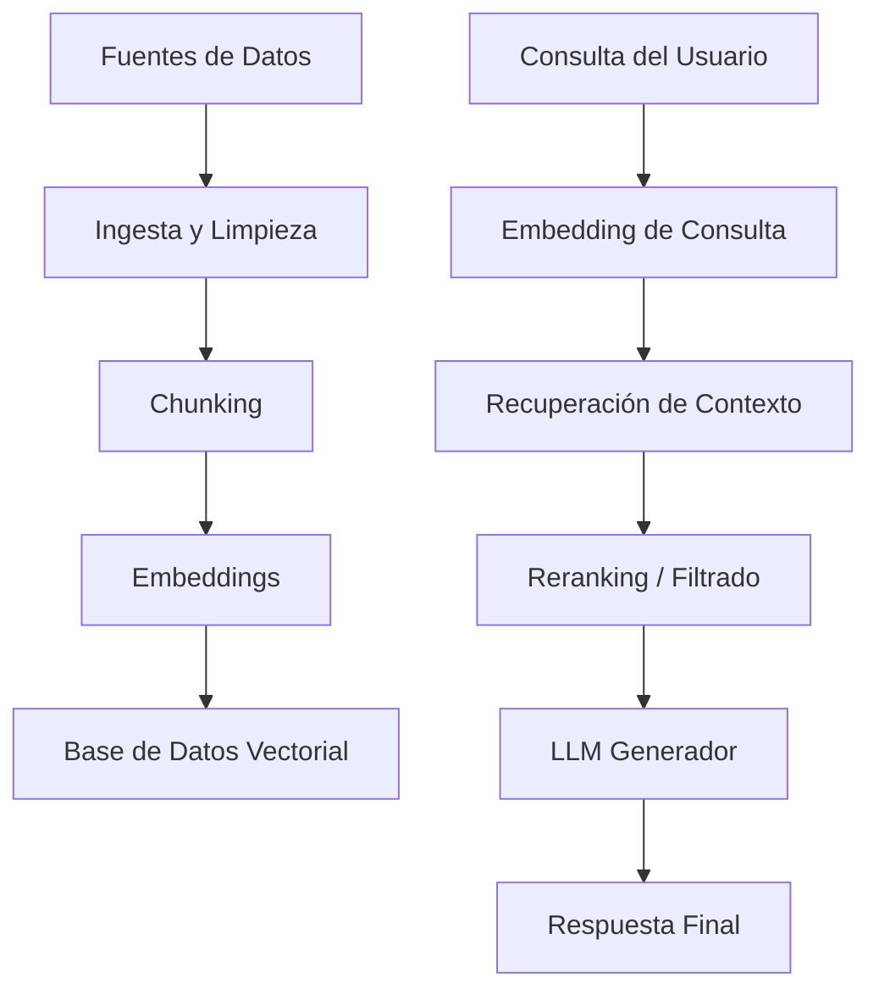
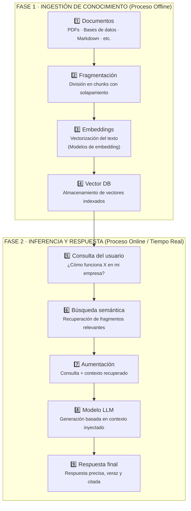

# Pipeline RAG – Visión General

Un sistema RAG no es un componente aislado, sino un pipeline compuesto por múltiples etapas interdependientes. Cada una cumple una función específica y su correcta orquestación determina la calidad, confiabilidad, latencia y costo del sistema completo.

El pipeline puede dividirse conceptualmente en dos flujos principales:
1. **Flujo offline (preparación del conocimiento)**: ingesta, limpieza, chunking y generación de embeddings.
2. **Flujo online (tiempo de consulta)**: procesamiento de la pregunta, recuperación de contexto, generación y evaluación.

Cada bloque del pipeline introduce decisiones de diseño críticas. Por ejemplo, una mala estrategia de chunking puede degradar la recuperación incluso si el modelo de embedding es de alta calidad. De igual forma, una recuperación deficiente no puede ser compensada por un modelo generativo más potente.

Por esta razón, RAG debe entenderse como un **sistema**, no como una simple técnica.
## Desglose del pipeline

- Datos → [[RAG - Ingesta de Datos]]
- Representación semántica → [[RAG - Embeddings y Vector DB]]
- Recuperación → [[RAG - Recuperación]]
- Generación → [[RAG - Generación]]
- Validación → [[RAG - Evaluación]]