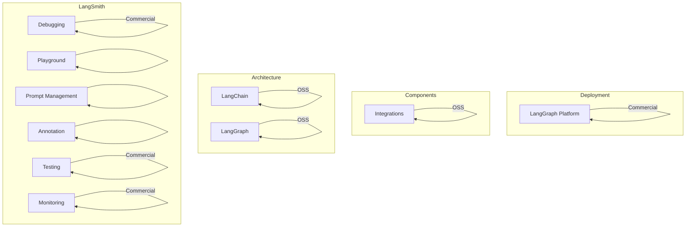
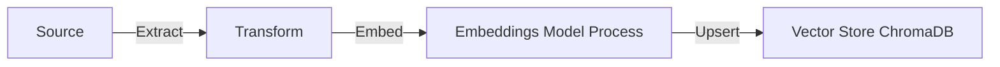
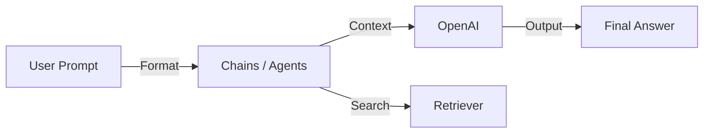
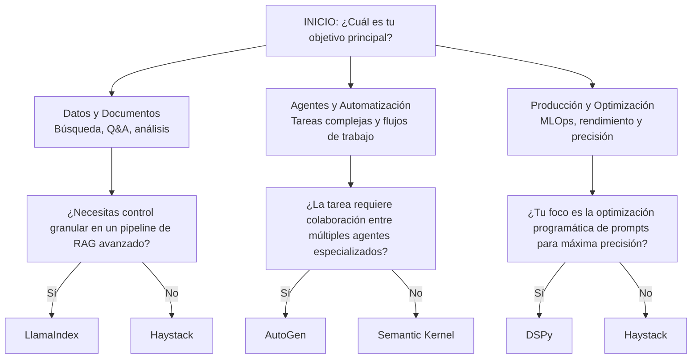

# LangChain: Framework para construir soluciones RAG y agénticas

- **LangChain** es un **framework** (un conjunto de herramientas o estructura de software) diseñado para ayudar a construir aplicaciones que utilicen LLMs de manera eficiente.
    
- El **framework LangChain** facilita la integración de diferentes servicios, bases de datos y módulos, lo que te permite encadenar (o combinar) varias herramientas para lograr tareas más complejas.
    
- Por ejemplo, con LangChain puedes:
    
    - Recuperar información de bases de datos.
        
    - Encadenar diferentes modelos de lenguaje o pasos de procesamiento (como hacer una consulta a un modelo y luego procesar los resultados).
        
    - Usar **RAG**, que te ayuda a mejorar la capacidad de los modelos de lenguaje al permitirles buscar información antes de generar una respuesta.

Construir, controlar y observar sistemas agénticos complejos

Está compuesto por:
- LancgChain
- LangGraph
- LangSmith

## Ecosistema:



> Sirve para la abstracción y la estandarización, simplificando la orquestación de los diversos componentes necesarios para construir un agente o un pipeline de RAG.

## Ingesta (ETL) Pipeline



### Cargador de datos (source)
| PDF Loader | Web Scraper | CSV Parser | Notion |
|------------|-------------|------------|--------|

### Base de datos (Vectorial)
| ChromaDB | Pinecone | Weaviate | FAISS |
|----------|----------|----------|-------|

### Modelos (LLM)
| OpenAI | Anthropic | Llama 3 | Mistral |
|--------|-----------|---------|---------|


## **Orquestación de Respuesta (RAG)**:



## LCEL (LangChain Expression Language)
Es un lenguaje declarativo que permite "encadenar" componentes de forma simple y legible.
``` python
from langchain_openai import ChatOpenAI

from langchain_core.prompts import ChatPromptTemplate

from langchain_core.output_parsers import StrOutputParser

  

# Definición de componentes

prompt = ChatPromptTemplate.from_template("Responde brevemente: {pregunta}")

model = ChatOpenAI(model="gpt-4")

parser = StrOutputParser()

  

# Composición declarativa con LCEL usando el operador pipe (|)

chain = prompt | model | parser

  

# Ejecución

respuesta = chain.invoke({"pregunta": "¿Qué es RAG?"})
```

## Pipelines de RAG:
el framework incluye unas herramientas para los pipelines de RAG incluyendo:
- **Document Loaders**: Para ingestar datos de diversas fuentes (PDFs, sitios web, bases de datos)    
- **Text Splitters**: Para dividir documentos grandes en fragmentos manejables    
- **Retrievers**: Que se conectan a bases de datos vectoriales para buscar y recuperar la información más relevante para una consulta dada
## LangGraph: Agentes
Ofrece implementaciones para patrones de razonamiento como ReAct (reasoning and acting)
LangChein 

>Las "Cadenas" de LangChain son, por diseño, **Grafos Acíclicos Dirigidos (DAGs)**, lo que significa que no pueden representar ciclos de forma nativa. Aquí es donde interviene LangGraph.

LangGraph fue creado específicamente para modelar los flujos de trabajo de los agentes, que son **inherentemente cíclicos**. Un agente necesita poder:

1. Intentar una acción
2. Evaluar el resultado
3. Decidir si reintenta, prueba una herramienta diferente, o finaliza

## LangSmith: Observabilidad y evaluación

> LangSmith proporciona las herramientas para rastrear, analizar y evaluar el comportamiento de los agentes de principio a fin.

### Funcionalidad:
- Depuración y trazabilidad:
	- trazas de cada ejecución de una cadena o grafo
	
- Pruebas y evaluación:
	- permite crear conjuntos de datos de evaluación
	- regresiones de rendimiento
	- "LLM-as-a-Judge"

> Usaremos LangSmith para evaluar y depurar nuestros pipelines RAG, midiendo métricas como fidelidad de las respuestas, relevancia del contexto recuperado y precisión general del sistema.


## Componentes:

| **CONSTRUIR**   | **CONTROLAR**   | **OBSERVAR**   |
|-----------------|-----------------|----------------|
| **LangChain**   | **LangGraph**   | **LangSmith**  |
| • Componentes   | • Grafos de estado | • Trazabilidad |
| • Cadenas LCEL  | • Flujos cíclicos  | • Depuración   |
| • RAG modules   |                 | • Evaluación   |
| • Integraciones |                 | • Monitoreo    |

## Paquetes principales

| **Paquete**                             | **Propósito**                                      | **Estabilidad**                 |
|-----------------------------------------|---------------------------------------------------|---------------------------------|
| langchain-core                          | Abstracciones base, interfaces para modelos, LCEL | Alta (versionado estricto)      |
| langchain-community                     | Integraciones de terceros                         | Media (actualizaciones frecuentes) |
| langchain                               | Componentes de aplicación de alto nivel, arquitecturas de agentes | Media-Alta                     |
| langchain-openai, langchain-anthropic, etc. | Integraciones específicas de proveedores          | Alta                            |

### Planificación-Ejecución (Plan-and-Execute)

Para tareas de larga duración y alta complejidad, el patrón **Plan-and-Execute** ofrece una alternativa robusta:

1. **Fase de planificación:** Un LLM potente genera un plan detallado paso a paso
    
2. **Fase de ejecución:** Un ejecutor (que puede ser un agente más simple o código determinista) sigue las instrucciones del plan
    
3. **Verificación opcional:** Evaluación del resultado con posible re-planificación
    

Esta arquitectura se mapea perfectamente a un grafo de LangGraph, donde el "plan" es parte del estado y nodos especializados manejan la planificación, ejecución y re-planificación.


# Alternativas a LangChain

